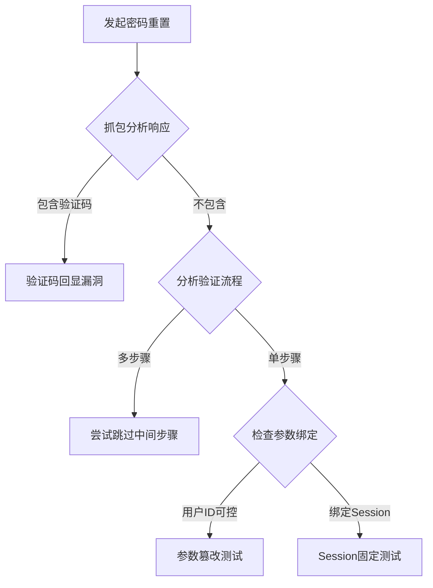
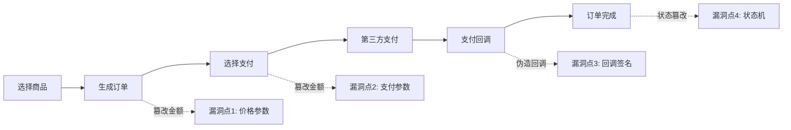

# 逻辑漏洞深度分析手册

> 基于 WooYun 真实案例库提炼，覆盖8292个设计缺陷/逻辑错误漏洞

---

## 一、核心洞察：逻辑漏洞的本质

### 1.1 根因分析矩阵

| 层级 | 缺陷类型 | 典型表现 | 检测难度 |
|------|----------|----------|----------|
| **业务层** | 流程设计缺陷 | 步骤可跳过、状态可伪造 | 高 |
| **接口层** | 参数信任过度 | 客户端校验、服务端未验证 | 中 |
| **认证层** | 凭证管理缺陷 | Token泄露、Session固定 | 中 |
| **授权层** | 权限边界模糊 | 水平/垂直越权 | 高 |

### 1.2 攻击面映射

```
用户输入 → 前端校验(可绑过) → 网络传输(可截获) → 后端处理(核心)
                ↓                    ↓                   ↓
           客户端参数篡改      中间人攻击/重放      服务端逻辑缺陷
```

---

## 二、密码重置漏洞 [22案例]

### 2.1 漏洞模式分类

#### 模式A：验证码回显泄露
**案例：某停车平台某停车平台APP、某社区平台、某运营商某邮箱服务**

```
攻击流程:
1. 请求发送验证码 → 拦截响应包
2. 响应包中直接包含验证码明文
3. 无需接收短信即可完成验证
```

**检测方法:**
```http
POST /sendSmsCode HTTP/1.1
phone=13888888888

# 检查响应:
{"code":0,"data":{"verifyCode":"123456"}}  ← 泄露点
```

#### 模式B：验证码与用户解绑
**案例：某记账APP(影响8000W用户)**

```
漏洞逻辑:
1. 用自己手机号注册，收到验证码A
2. 对目标账号发起找回密码请求
3. 直接使用验证码A完成验证 ← 未绑定用户身份
```

**根因:** 验证码仅校验有效性，未校验归属用户

#### 模式C：重置步骤可跳过
**案例：某户外用品商城、有问必答网**

```
正常流程: 输入账号 → 身份验证 → 重置密码 → 完成
攻击流程: 输入账号 → [跳过验证] → 直接访问重置页面

技术实现:
1. 分析前端JS逻辑，找到各步骤URL
2. 直接访问第3步URL
3. 前端隐藏DOM元素替换法:
   - F12找到"重置密码"步骤的HTML
   - 覆盖当前"身份验证"步骤的DOM
```

#### 模式D：凭证参数可控
**案例：读览天下、小牛电动车**

```http
POST /resetPassword HTTP/1.1
username=victim&newPassword=hacked123

# 漏洞: username参数来自客户端，可被篡改
```

**测试Checklist:**
- [ ] 重置请求中是否包含用户标识符
- [ ] 该标识符是否可被修改
- [ ] 修改后是否影响其他用户

### 2.2 通用测试框架



---

## 三、越权访问漏洞 [22案例]

### 3.1 水平越权（IDOR）

#### 典型场景: ID遍历
**案例：一嗨租车、某成人用品商城(20W+用户)**

```http
# 正常请求
GET /address/edit/?addid=100001  → 自己的地址

# 越权请求
GET /address/edit/?addid=100002  → 他人的地址
GET /address/edit/?addid=1       → 遍历所有用户
```

**自动化检测脚本思路:**
```python
def idor_test(base_url, param_name, id_range):
    for id in range(id_range[0], id_range[1]):
        resp = requests.get(f"{base_url}?{param_name}={id}")
        if "敏感数据特征" in resp.text:
            print(f"[!] IDOR Found: {param_name}={id}")
```

#### 典型场景: 资源替换攻击
**案例：一嗨租车发票越权删除**

```
漏洞逻辑:
1. 账号A创建发票，ID=1001
2. 账号B修改自己发票时，替换ID为1001
3. 系统执行UPDATE操作，账号A的发票被覆盖/删除

攻击向量: 修改操作缺少所有权验证
```

### 3.2 垂直越权

#### 典型场景: 角色提权
**案例：浙江在线系统越权**

```http
# 普通用户修改资料
POST /updateUser HTTP/1.1
user.aid=3&user.name=test   # aid=3 为普通用户

# 越权提权
POST /updateUser HTTP/1.1
user.aid=1&user.name=test   # aid=1 为超级管理员
```

**检测要点:**
1. 枚举角色ID: 通常 1=超管, 2=管理员, 3+=普通用户
2. 测试角色切换: 修改请求中的角色标识
3. 验证权限变化: 刷新后检查菜单/功能变化

### 3.3 越权测试矩阵

| 操作类型 | 测试方法 | 风险等级 |
|----------|----------|----------|
| 查看 | 替换资源ID | 中 |
| 修改 | 替换资源ID + 数据 | 高 |
| 删除 | 替换资源ID | 严重 |
| 创建 | 替换归属用户ID | 高 |

---

## 四、验证码绕过漏洞 [20案例]

### 4.1 验证码不刷新

**案例：南京住房公积金系统、捷依物联网**

```
漏洞表现:
- 登录失败后验证码不自动刷新
- 同一验证码可重复使用
- 仅前端触发刷新，后端未强制更新
```

**利用方式:**
```python
# 固定验证码爆破
captcha = "ABCD"  # 手工识别一次
for password in wordlist:
    resp = login(username, password, captcha)
    if "success" in resp:
        print(f"Password: {password}")
```

### 4.2 验证码可爆破

**案例：某品牌商城APP(5位数字验证码)**

```
参数分析:
- 验证码长度: 4-6位数字
- 爆破空间: 10000-1000000
- 限制条件: 无次数/频率限制

爆破配置:
- 线程: 30-50
- 字典: 00000-99999
- 耗时: ~30秒完成
```

### 4.3 撞库攻击

**案例：TOM在线、某手机厂商**

```
前提条件:
1. 登录接口无验证码/验证码可绕过
2. 无登录频率限制
3. 存在已泄露的账号密码库

攻击流程:
1. 获取泄露数据库(如某手机厂商论坛8W弱口令)
2. 针对目标网站批量尝试
3. 成功率通常 0.1%-5%
```

### 4.4 验证码安全检测清单

- [ ] 验证码是否在响应中泄露
- [ ] 验证码是否与Session/用户绑定
- [ ] 验证码是否有时效性(建议60秒)
- [ ] 验证失败是否强制刷新
- [ ] 是否有频率限制(建议5次/分钟)
- [ ] 验证码复杂度是否足够(建议6位+字母)

---

## 五、支付逻辑漏洞 [9案例]

### 5.1 金额篡改

**案例：中国才储、春趣商城**

```http
# 原始请求
POST /pay HTTP/1.1
item=测试服务&price=500&count=1

# 篡改请求
POST /pay HTTP/1.1
item=测试服务&price=0.01&count=1
```

**检测点:**
1. 订单生成时的金额参数
2. 支付跳转时的金额参数
3. 支付回调时的金额校验

### 5.2 优惠券/折扣滥用

**案例：某电商平台折扣逻辑问题**

```
漏洞流程:
1. 购买商品A(59元)，满足"满59加5.9换购B"条件
2. 下单包含A和B，支付59+5.9=64.9元
3. 取消商品A，仅保留B
4. 实际以5.9元购得原价21元的商品B
```

**测试思路:**
- 组合订单后部分取消
- 优惠券使用后退货
- 积分兑换后退款

### 5.3 虚拟货币刷取

**案例：某手机厂商积分商城**

```
漏洞: 注册推广可获积分
攻击:
1. 发现手机验证码为4位数字
2. 暴力破解验证码完成注册
3. 自动化脚本批量注册
4. 积分兑换实物商品
```

### 5.4 订单价格参数篡改

**案例：某电商平台价格逻辑漏洞 (wooyun-2015-0108817)**

```
漏洞本质: 信任客户端提交的价格参数
危害等级: 高
攻击手法: 直接修改订单创建接口的price参数
```

**漏洞分析:**

正常订单流程应遵循:
```
[选择商品] → [生成订单] → [服务端计算价格] → [用户支付]
```

存在漏洞的流程:
```
[选择商品] → [生成订单] → [客户端提交价格] → [服务端未验证] → [任意价格支付]
```

**攻击向量:**
```http
# 正常请求
POST /order/create HTTP/1.1
{
  "productId": "12345",
  "quantity": 1,
  "price": 299.00  ← 原价
}

# 恶意请求
POST /order/create HTTP/1.1
{
  "productId": "12345",
  "quantity": 1,
  "price": 0.01  ← 篡改为0.01元
}
```

**INTJ式深度思考 - 根因追溯:**

1. **设计层面缺陷**
   - 违反"服务端权威"原则
   - 价格计算逻辑下沉到客户端
   - 未实施价格二次校验机制

2. **信任边界错误**
   ```
   安全模型: 不可信区域(客户端) → 信任边界 → 可信区域(服务端)
   错误实现: 直接接受不可信区域的敏感数据作为事实依据
   正确实现: 不可信区域仅提供商品ID,服务端独立计算价格
   ```

3. **业务逻辑分层失败**
   ```
   表现层: 展示商品价格 (可篡改)
   业务层: 计算订单金额 (应独立)
   数据层: 存储交易记录 (应校验)
   ```

**系统化测试方法论:**

```
Phase 1: 参数指纹识别
├── 抓包订单创建接口
├── 识别价格相关参数 (price/amount/total/cost)
└── 确定参数类型 (整型/浮点/字符串)

Phase 2: 边界值测试
├── 最小值测试 (0, 0.01, -1)
├── 负数测试 (-100, -0.01)
├── 格式测试 (科学计数法, JSON嵌套)
└── 精度测试 (浮点溢出, 舍入误差)

Phase 3: 逻辑绕过测试
├── 参数冗余: 提交多个价格参数
├── 参数覆盖: 先提价后降价
├── 批量订单: 单价篡改
└── 优惠券叠加: 价格+折扣双重操纵

Phase 4: 影响验证
├── 订单生成: 检查订单金额
├── 支付网关: 验证支付金额
├── 物流发货: 测试是否正常发货
└── 退款流程: 检查退款金额
```

**高级利用技巧:**

1. **价格参数篡改 + 并发竞争**
```python
import threading

def create_order():
    # 同时创建多个低价订单
    requests.post("/order/create", json={
        "price": 0.01,
        "productId": "premium_item"
    })

threads = [threading.Thread(target=create_order) for _ in range(50)]
for t in threads:
    t.start()
```

2. **参数污染技术**
```http
# 某些框架会处理重复参数
POST /order/create?price=299.00&price=0.01

# 或者数组参数
POST /order/create
price[]=299.00&price[]=0.01
```

3. **类型转换绕过**
```json
{
  "price": "0.01",        // 字符串
  "price": 1e-10,         // 科学计数法
  "price": {"$gt": 0},    // MongoDB注入
  "price": null           // NULL注入
}
```

**检测清单:**

| 测试项 | 预期行为 | 实际检查 |
|--------|----------|----------|
| 服务端计算价格 | 根据商品ID查询数据库 | ✓ 订单金额 = 库存价格 × 数量 |
| 客户端价格校验 | 忽略提交的价格 | ✓ 仅作展示参考 |
| 价格签名验证 | 订单参数签名 | ✓ 防篡改机制 |
| 支付金额比对 | 回调金额 = 订单金额 | ✓ 三方支付验证 |
| 异常价格拦截 | 价格异常时拒绝 | ✓ 低于成本价/高于定价 |

**修复建议:**

```python
# 安全的实现示例
def create_order(user_id, product_id, quantity):
    # 1. 从数据库获取商品价格 (服务端权威)
    product = db.query("SELECT price FROM products WHERE id = ?", product_id)
    if not product:
        raise Exception("商品不存在")

    # 2. 服务端计算订单金额
    order_amount = product.price * quantity

    # 3. 记录原始价格和计算价格用于审计
    order = {
        "user_id": user_id,
        "product_id": product_id,
        "quantity": quantity,
        "unit_price": product.price,
        "total_amount": order_amount,
        "price_source": "server_calculation"  # 标记价格来源
    }

    # 4. 生成订单签名 (防篡改)
    order["signature"] = hmac_sha256(
        f"{order_amount}{product_id}{quantity}",
        SECRET_KEY
    )

    return db.insert("orders", order)

# 支付回调验证
def payment_callback(order_id, paid_amount, signature):
    order = db.get_order(order_id)

    # 严格校验支付金额与订单金额一致
    if order["total_amount"] != paid_amount:
        raise Exception("支付金额不匹配")

    # 验证签名
    if not verify_signature(signature, order):
        raise Exception("签名验证失败")

    # 更新订单状态
    order["status"] = "paid"
    order["paid_amount"] = paid_amount
    db.update(order)
```

**防御纵深策略:**

```
Layer 1: 输入验证
├── 白名单校验: 仅接受商品ID,不接受价格参数
└── 类型校验: 金额必须是正数,最多2位小数

Layer 2: 业务逻辑
├── 服务端计算: 所有价格在服务端重新计算
├── 价格溯源: 记录价格计算过程
└── 异常检测: 价格偏离度超过阈值时人工审核

Layer 3: 数据完整性
├── 订单签名: 防止参数篡改
├── 时间戳: 防止重放攻击
└── 幂等性: 防止重复提交

Layer 4: 支付验证
├── 回调校验: 验证支付金额与订单金额一致性
├── 状态机: 严格控制订单状态流转
└── 审计日志: 记录所有价格变更
```

### 5.5 支付流程完整性测试



---

## 六、身份认证绕过 [15案例]

### 6.1 Cookie/Session伪造

**案例：福建网龙平台**

```
漏洞接口:
GET /registeruser/CookInsert?userAccount=admin&inner=1

作用: 向Cookie写入用户身份
利用: 直接指定任意用户名即可获得该用户Session
```

### 6.2 IP伪造

**案例：WDCP后台**

```http
# 添加伪造Header
X-Forwarded-For: [IP已脱敏]
X-Real-IP: [IP已脱敏]
Client-IP: [IP已脱敏]

风险: 绕过IP白名单、伪造登录日志
```

### 6.3 响应篡改绕过

**案例：健一网APP、你我金融**

```
正常流程:
请求验证 → 响应{"status":"0","msg":"验证码错误"} → 停留验证页

攻击流程:
请求验证 → 拦截响应 → 修改为{"status":"1","msg":"成功"} → 进入下一步
```

**适用条件:**
- 客户端根据响应状态控制流程
- 服务端未在后续步骤重新验证状态

### 6.4 认证绕过测试清单

| 测试项 | 方法 | 工具 |
|--------|------|------|
| Cookie伪造 | 修改用户标识字段 | BurpSuite |
| Session固定 | 复用他人Session | Wireshark |
| 响应篡改 | 修改返回状态码 | BurpSuite |
| IP伪造 | 添加X-Forwarded-For | Curl |
| 前端绕过 | 修改JS逻辑 | Browser DevTools |

---

## 七、高级测试方法论

### 7.1 业务流程逆向分析

```
步骤1: 绘制完整业务流程图
步骤2: 识别每个环节的校验点
步骤3: 评估校验是否可绕过
步骤4: 设计绕过测试用例
```

**示例: 密码重置流程分析**

```
[输入账号] → [发送验证码] → [验证身份] → [设置新密码]
     ↓              ↓              ↓              ↓
  账号枚举      验证码泄露      步骤跳过      参数篡改
```

### 7.2 参数篡改系统化方法

| 参数类型 | 篡改方向 | 示例 |
|----------|----------|------|
| 用户ID | 替换为其他用户 | uid=1001 → uid=1002 |
| 金额 | 减小/归零/负数 | price=100 → price=0.01 |
| 数量 | 增大/负数 | count=1 → count=-1 |
| 状态 | 翻转布尔值 | isPaid=false → isPaid=true |
| 角色 | 提升权限 | role=user → role=admin |
| 时间 | 延长/回退 | expireTime=... → expireTime=2099-... |

### 7.3 条件竞争利用

**场景: 积分兑换**

```python
import threading
import requests

def redeem():
    requests.post("/redeem", data={"points": 1000, "item": "iPhone"})

# 并发请求，尝试多次兑换
threads = [threading.Thread(target=redeem) for _ in range(100)]
for t in threads:
    t.start()
```

**适用场景:**
- 优惠券使用
- 积分兑换
- 库存扣减
- 余额支付

### 7.4 INTJ式系统化测试框架

```
Phase 1: 情报收集
├── 枚举所有功能点
├── 绘制业务流程图
└── 识别敏感操作

Phase 2: 威胁建模
├── 分析每个接口的输入参数
├── 评估参数的可控性
└── 构建攻击树

Phase 3: 漏洞验证
├── 按优先级测试
├── 记录POC
└── 评估影响范围

Phase 4: 报告输出
├── 漏洞描述
├── 复现步骤
├── 修复建议
└── 风险评级
```

---

## 八、防御建议速查

### 8.1 密码重置

- 验证码绑定用户Session
- 验证码单次有效+时效限制
- 重置Token一次性使用
- 全流程服务端状态校验

### 8.2 越权访问

- 资源访问前校验所有权
- 使用UUID替代自增ID
- 敏感操作记录审计日志
- 实施最小权限原则

### 8.3 支付安全

- 金额由服务端计算
- 订单签名防篡改
- 支付回调二次验证
- 交易幂等性设计

### 8.4 验证码

- 6位字母数字混合
- 60秒过期
- 5次错误锁定
- 验证失败强制刷新

---

## 九、实战工具推荐

| 工具 | 用途 | 场景 |
|------|------|------|
| BurpSuite | 流量拦截篡改 | 全场景 |
| Postman | API测试 | 接口测试 |
| SQLMap | 注入检测 | 数据库 |
| Hydra | 爆破 | 弱口令 |
| OWASP ZAP | 自动化扫描 | 初筛 |

---

## 十、参考案例索引

| 漏洞类型 | 代表案例 | WooYun ID |
|----------|----------|-----------|
| 验证码回显 | 某停车平台某停车平台APP | wooyun-2015-0134914 |
| 密码重置跳过 | 某户外用品商城 | wooyun-2014-054890 |
| 水平越权 | 某成人用品商城 | wooyun-2015-0119942 |
| 垂直越权 | 浙江在线系统 | wooyun-2015-099378 |
| 金额篡改 | 中国才储 | wooyun-2012-07745 |
| 价格参数篡改 | 某电商平台 | wooyun-2015-0108817 |
| 优惠券滥用 | 某电商平台折扣逻辑 | wooyun-2015-0XXXXXX |
| 虚拟货币刷取 | 某手机厂商积分商城 | wooyun-2015-0XXXXXX |
| 撞库攻击 | 某手机厂商 | wooyun-2014-061871 |
| Cookie伪造 | 福建网龙 | wooyun-2015-0157092 |
| 响应篡改 | 健一网APP | wooyun-2015-0139590 |

---

*文档版本: v1.1*
*数据来源: WooYun漏洞库 (88,636条)*
*分析样本: 设计缺陷/逻辑错误类 (8,292条)*
*生成时间: 2026-01-23*
*最新更新: 新增价格参数篡改漏洞深度分析 (wooyun-2015-0108817)*
